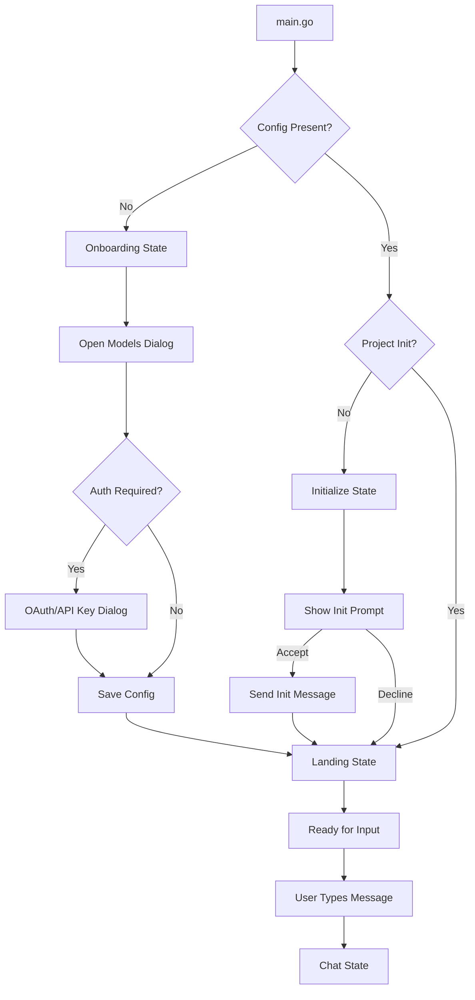
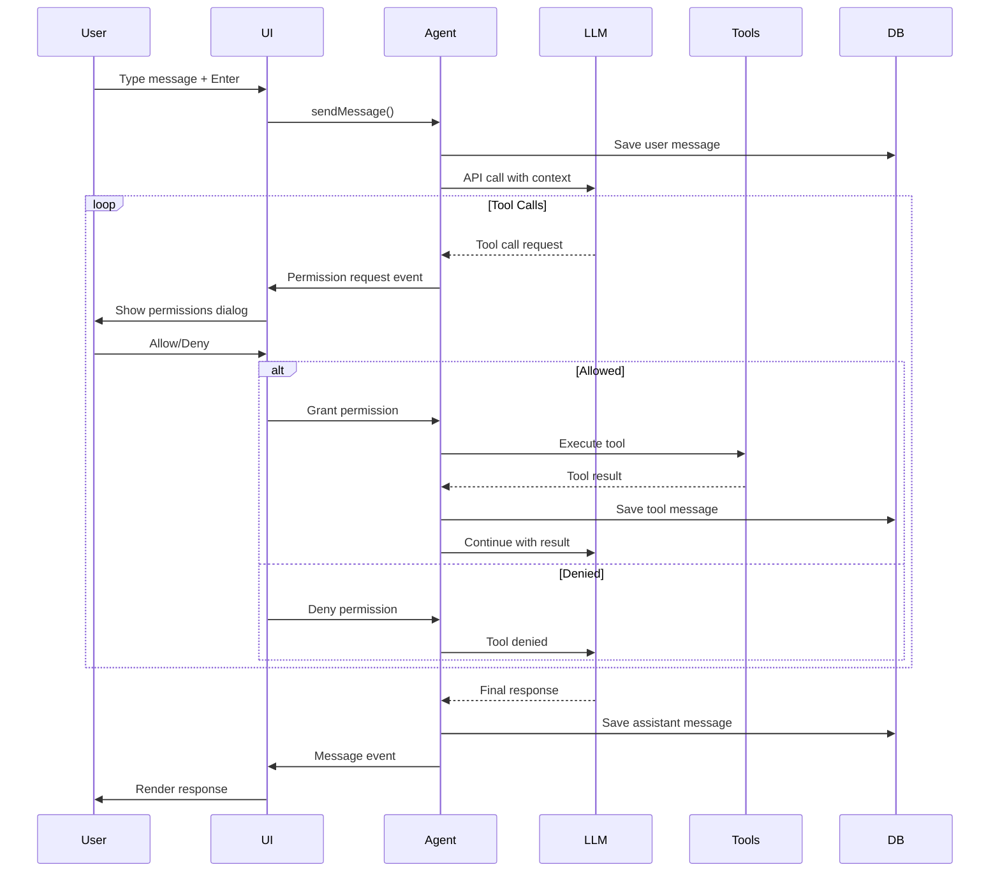

# Crush - Agentic Coding Shell

> **Source**: Fork of [charmbracelet/crush](https://github.com/charmbracelet/crush)
> **Category**: Agentic shell workflow for terminal-based AI coding
> **Technology**: Go, Bubble Tea v2, SQLite, Ultraviolet rendering

---

## Table of Contents

- [Overview](#overview)
- [Core Functionality](#core-functionality)
- [Architecture](#architecture)
- [User Flow](#user-flow)
- [UI Components & Screens](#ui-components--screens)
- [Technology Stack](#technology-stack)
- [Key Features Deep Dive](#key-features-deep-dive)
- [Integration Patterns](#integration-patterns)

---

## Overview

**Crush** is a terminal-based AI coding assistant that brings multi-model LLM capabilities directly into your development workflow. It functions as both an interactive TUI application and a non-interactive CLI tool, providing a full-fledged agentic environment that can understand codebases, execute commands, modify files, and work alongside developers.

### What Makes Crush Unique

- **Multi-Model Support**: Seamlessly switch between Anthropic, OpenAI, Groq, Google Gemini, Azure OpenAI, and Amazon Bedrock mid-session
- **Language Server Protocol (LSP) Integration**: Code-aware context similar to traditional IDEs
- **Model Context Protocol (MCP) Extensibility**: Add custom tools via stdio, HTTP, or SSE transports
- **Agent Skills Standard**: Auto-discovers and activates skills from SKILL.md files
- **Session-Based Persistence**: SQLite-backed conversation history per project
- **Permission-Based Security**: Approve or deny each tool execution (or use `--yolo` mode)

---

## Core Functionality

### 1. Agentic Interaction

Crush IS the AI agent - it provides the primary interface for:
- Natural language code requests
- File operations (read, write, edit)
- Shell command execution with approval
- Web searches and HTTP fetching
- LSP-based code navigation
- MCP tool invocation

### 2. Multi-Model Architecture

Switch between LLM providers and models without losing context:
```
Anthropic (Claude Opus, Sonnet, Haiku)
OpenAI (GPT-4, GPT-5)
Google (Gemini models)
Azure OpenAI
Amazon Bedrock
Groq
Custom providers (OpenAI-compatible APIs)
```

### 3. Project Awareness

Each project gets isolated context:
```
.crush/
├── crush.db              # SQLite session database
├── .crush.json           # Project-specific config
└── AGENTS.md             # Project conventions/patterns
```

### 4. Tool System

40+ built-in agent tools:
- **File Operations**: bash, edit, multiedit, write, view, read
- **Search**: glob, grep, ls, search, sourcegraph
- **Web**: fetch, web_fetch, web_search, download
- **Code Intelligence**: diagnostics, references (LSP-based), todos
- **Background Jobs**: job_output, job_kill
- **MCP Tools**: Dynamic tool loading from MCP servers

---

## Architecture

### Three-Layer Stack

```
┌─────────────────────────────────────────────────┐
│              CLI Layer (Cobra)                   │
│  root.go, run.go, login.go, models.go, etc.     │
└──────────────────────┬──────────────────────────┘
                       │
┌──────────────────────▼──────────────────────────┐
│           App Layer (Orchestrator)               │
│  app.go - Wires services, manages lifecycle     │
└──────────────────────┬──────────────────────────┘
                       │
        ┌──────────────┼──────────────┐
        │              │              │
┌───────▼────┐  ┌──────▼─────┐  ┌────▼──────┐
│ Agent/AI   │  │  UI Layer  │  │  Config   │
│  (tools,   │  │ (Bubble    │  │  (JSON,   │
│  prompts)  │  │  Tea v2)   │  │  Catwalk) │
└────────────┘  └────────────┘  └───────────┘
        │              │              │
┌───────▼─────────────────────────────▼──────────┐
│      Data Layer (SQLite + Message/Session)     │
│  db.go, sessions.sql, messages.sql, files.sql  │
└────────────────────────────────────────────────┘
```

### Data Flow

```
User Input (TUI/CLI)
    ↓
UI Model (ui.go)
    ↓
App/Agent Coordinator
    ↓
SessionAgent → Fantasy SDK → LLM Provider
    ↓
Tool Execution (with permission check)
    ↓
Tool Result → Message Storage (SQLite)
    ↓
Response Rendering (chat/)
```

### Key Design Patterns

#### Smart Main Model, Dumb Components
- Only `ui.UI` struct handles Bubble Tea messages directly
- Components expose methods that return `tea.Cmd` for side effects
- Page system provides pluggable architecture for views

#### Event-Driven Architecture
- Pub/sub system for inter-service communication (`pubsub/broker.go`)
- Non-blocking event dispatch
- Cross-service messages: file changes, LSP diagnostics, permission requests

#### Service Pattern
- Database access via sqlc-generated interfaces
- Provider abstraction for multi-LLM support
- Tool registry with factory pattern

---

## User Flow

### Application Launch Flow



### Chat Interaction Flow



### State Machine

```
┌─────────────┐  Config missing   ┌──────────────┐
│             │ ────────────────> │              │
│   Initial   │                   │  Onboarding  │
│             │ <──────────────── │              │
└─────────────┘   Auth complete   └──────────────┘
       │
       │ Config exists
       ▼
┌─────────────┐  Not initialized  ┌──────────────┐
│             │ ────────────────> │              │
│   Landing   │                   │  Initialize  │
│             │ <──────────────── │              │
└─────────────┘   Init complete   └──────────────┘
       │
       │ First message
       ▼
┌─────────────┐
│             │
│    Chat     │ ◄─── Session switch ───┐
│             │                         │
└─────────────┘                         │
       │                                │
       └────────────────────────────────┘
```

---

## UI Components & Screens

### 1. Onboarding Screen

**State**: `uiOnboarding`
**File**: [`ref/crush/internal/ui/model/onboarding.go`](ref/crush/internal/ui/model/onboarding.go)

```
╔══════════════════════════════════════════════════════════════╗
║                                                              ║
║                    ██████╗██████╗ ██╗   ██╗███████╗██╗  ██╗║
║                   ██╔════╝██╔══██╗██║   ██║██╔════╝██║  ██║║
║                   ██║     ██████╔╝██║   ██║███████╗███████║║
║                   ██║     ██╔══██╗██║   ██║╚════██║██╔══██║║
║                   ╚██████╗██║  ██║╚██████╔╝███████║██║  ██║║
║                    ╚═════╝╚═╝  ╚═╝ ╚═════╝ ╚══════╝╚═╝  ╚═╝║
║                                                              ║
║                   Glamourous agentic coding for all         ║
║                                                              ║
╠══════════════════════════════════════════════════════════════╣
║                                                              ║
║   ┌────────────────────────────────────────────────────┐   ║
║   │ [Dialog] Select Your Model                         │   ║
║   │                                                     │   ║
║   │  Providers                                          │   ║
║   │  ┌───────────────────┐                             │   ║
║   │  │ Anthropic        ▼│                             │   ║
║   │  │ OpenAI            │                             │   ║
║   │  │ Google            │                             │   ║
║   │  │ Groq              │                             │   ║
║   │  └───────────────────┘                             │   ║
║   │                                                     │   ║
║   │  Models                                             │   ║
║   │  ┌───────────────────────────────────────────┐    │   ║
║   │  │ ● Claude Opus 4.6  (Recommended)          │    │   ║
║   │  │   Claude Sonnet 4.5                       │    │   ║
║   │  │   Claude Haiku 4.5                        │    │   ║
║   │  └───────────────────────────────────────────┘    │   ║
║   │                                                     │   ║
║   │  [Enter] Select  [Esc] Cancel  [/] Search          │   ║
║   └────────────────────────────────────────────────────┘   ║
║                                                              ║
╚══════════════════════════════════════════════════════════════╝
```

**Layout**:
- Full-screen logo display
- Centered modal dialog overlay
- Model selection organized by provider
- Fuzzy search with `/` key

### 2. Landing Screen

**State**: `uiLanding`
**File**: [`ref/crush/internal/ui/model/landing.go`](ref/crush/internal/ui/model/landing.go)

```
╔══════════════════════════════════════════════════════════════╗
║  CRUSH (TM)                                                  ║
║                                                              ║
║  /home/user/projects/my-app                                 ║
║                                                              ║
║  Model: Claude Opus 4.6 · Anthropic · Standard · 0 tokens  ║
║                                                              ║
╠══════════════════════════════════════════════════════════════╣
║                                                              ║
║  LSP Servers                    MCP Servers                 ║
║  ┌──────────────────────┐      ┌──────────────────────┐   ║
║  │ ✓ typescript (ready) │      │ ✓ filesystem         │   ║
║  │ ✓ gopls (ready)      │      │ ✓ github             │   ║
║  │ ⚠ rust-analyzer      │      │ ✗ postgres (error)   │   ║
║  └──────────────────────┘      └──────────────────────┘   ║
║                                                              ║
║                                                              ║
╠══════════════════════════════════════════════════════════════╣
║ > What would you like to build?                             ║
║                                                              ║
║                                                              ║
║                                                              ║
║                                                              ║
╠══════════════════════════════════════════════════════════════╣
║ ctrl+p commands · ctrl+l models · ctrl+s sessions · ctrl+g help
╚══════════════════════════════════════════════════════════════╝
```

**Layout** (4 sections):
- **Header** (4 rows): Logo, working directory, model info
- **Main** (remaining): LSP/MCP status in two columns
- **Editor** (5 rows): Textarea for message input
- **Status** (1 row): Keybinding help

### 3. Chat Screen (Wide Mode)

**State**: `uiChat`, width ≥ 120
**File**: [`ref/crush/internal/ui/model/ui.go`](ref/crush/internal/ui/model/ui.go:2355-2383)

```
╔═══════════════════════════════════╦═════════════════════════════╗
║ Chat Messages                     ║ ┌─────────────────────────┐ ║
║                                   ║ │     ╔═╗╔═╗╦ ╦╔═╗╦ ╦     │ ║
║ You:                              ║ │     ║  ╠╦╝║ ║╚═╗╠═╣     │ ║
║ Add dark mode to the app          ║ │     ╚═╝╩╚═╚═╝╚═╝╩ ╩     │ ║
║                                   ║ └─────────────────────────┘ ║
║ Assistant:                        ║                             ║
║ I'll help add dark mode. Let me   ║ Project Name                ║
║ search for existing theme code... ║ /home/user/my-app           ║
║                                   ║                             ║
║ [Tool] Grep "theme" *.ts          ║ Model Info                  ║
║ Running...                        ║ Claude Opus 4.6             ║
║ ⠋ Searching codebase              ║ Anthropic                   ║
║                                   ║ Extended thinking           ║
║                                   ║ 45K / 200K tokens (22%)     ║
║                                   ║ $0.12                       ║
║                                   ║                             ║
║                                   ║ Modified Files              ║
║                                   ║ src/theme.ts       +45 -12  ║
║                                   ║ src/App.tsx        +8  -3   ║
║                                   ║                             ║
║                                   ║ LSP Status                  ║
║                                   ║ ✓ typescript (2 files)      ║
║                                   ║                             ║
║                                   ║ MCP Status                  ║
║                                   ║ ✓ filesystem (active)       ║
║                                   ║                             ║
╠═══════════════════════════════════╩═════════════════════════════╣
║ > Follow-up question?                                           ║
║                                                                  ║
╠═════════════════════════════════════════════════════════════════╣
║ tab focus · space expand · c copy · esc cancel · ctrl+g help   ║
╚═════════════════════════════════════════════════════════════════╝
```

**Layout** (sidebar width = 30 cols):
- **Main pane** (left): Chat message list with scrolling
- **Sidebar** (right): Logo, session title, model info, modified files, LSP/MCP status
- **Editor** (bottom): Message input
- **Status** (bottom): Context-aware keybindings

**Key Regions**:
- Messages: user messages, assistant responses, tool calls, thinking content
- Sidebar sections: dynamic height allocation with priority to modified files

### 4. Chat Screen (Compact Mode)

**State**: `uiChat`, width < 120 OR height < 30
**File**: [`ref/crush/internal/ui/model/ui.go`](ref/crush/internal/ui/model/ui.go:2322-2354)

```
╔═════════════════════════════════════════════════════════════════╗
║ Charm(TM) CRUSH // Session: Dark Mode // my-app // ctrl+d details
╠═════════════════════════════════════════════════════════════════╣
║                                                                 ║
║ You: Add dark mode to the app                                  ║
║                                                                 ║
║ Assistant: I'll help add dark mode. Let me search for          ║
║ existing theme code...                                          ║
║                                                                 ║
║ [Tool] Grep "theme" *.ts                                       ║
║ ┌─────────────────────────────────────────────────────────┐   ║
║ │ src/theme.ts:12: export const lightTheme = { ... }      │   ║
║ │ src/App.tsx:5: import { lightTheme } from './theme'     │   ║
║ │ [Showing 2 of 5 results - press space to expand]        │   ║
║ └─────────────────────────────────────────────────────────┘   ║
║                                                                 ║
║ Assistant: Found existing theme code. I'll create a dark       ║
║ theme variant. Let me modify the files...                      ║
║                                                                 ║
║ [Tool] Edit src/theme.ts                                       ║
║ Awaiting permission...                                          ║
║                                                                 ║
╠═════════════════════════════════════════════════════════════════╣
║ ┌─────────────────────────────────────────────────────────┐   ║
║ │ To-Do 3/5                                                │   ║
║ │ ⠋ Current: Update App.tsx to use theme toggle           │   ║
║ └─────────────────────────────────────────────────────────┘   ║
╠═════════════════════════════════════════════════════════════════╣
║ > Follow-up question?                                           ║
║                                                                 ║
╠═════════════════════════════════════════════════════════════════╣
║ tab focus · space expand · ctrl+d details · ctrl+space todos   ║
╚═════════════════════════════════════════════════════════════════╝
```

**Layout** (no sidebar):
- **Compact header** (1 row): App name, session title, working dir, hints
- **Main** (chat messages)
- **Pills** (optional): Todo/queue status when active
- **Editor** (5 rows)
- **Status** (1 row)

**Special Features**:
- `ctrl+d`: Toggle session details overlay (floating panel with full info)
- `ctrl+space`: Toggle pills panel expansion
- Reduced chrome for smaller terminals

### 5. Permissions Dialog

**File**: [`ref/crush/internal/ui/dialog/permissions.go`](ref/crush/internal/ui/dialog/permissions.go)

```
╔═════════════════════════════════════════════════════════════════╗
║                                                                 ║
║   ┌───────────────────────────────────────────────────────┐   ║
║   │ [Permission Required] Edit File                        │   ║
║   │                                                         │   ║
║   │ Tool: edit                                              │   ║
║   │ File: src/theme.ts                                      │   ║
║   │                                                         │   ║
║   │ ┌───────────────────────┬───────────────────────────┐ │   ║
║   │ │ export const lightThe │ export const lightTheme = │ │   ║
║   │ │ -  background: '#fff' │ -  background: '#ffffff'  │ │   ║
║   │ │ +  background: '#f8f8 │ +  background: '#f8f8f8'  │ │   ║
║   │ │ +  foreground: '#333' │ +  foreground: '#333333'  │ │   ║
║   │ │ }                     │ }                         │ │   ║
║   │ │                       │                           │ │   ║
║   │ │ +export const darkThe │ +export const darkTheme = │ │   ║
║   │ │ +  background: '#1e1e │ +  background: '#1e1e1e'  │ │   ║
║   │ │ +  foreground: '#d4d4 │ +  foreground: '#d4d4d4'  │ │   ║
║   │ │ +}                    │ +}                        │ │   ║
║   │ └───────────────────────┴───────────────────────────┘ │   ║
║   │                                                         │   ║
║   │ [s] Split  [u] Unified  [←→] Scroll                    │   ║
║   │                                                         │   ║
║   │ ┌─────────────────────────────────────────────────┐   │   ║
║   │ │ [a] Allow   [s] Allow Session   [d] Deny        │   │   ║
║   │ └─────────────────────────────────────────────────┘   │   ║
║   └───────────────────────────────────────────────────────┘   ║
║                                                                 ║
╚═════════════════════════════════════════════════════════════════╝
```

**Features**:
- **Diff viewing**: Side-by-side or unified format, toggle with `s`/`u`
- **Syntax highlighting**: Full Chroma-based highlighting
- **Horizontal scroll**: For wide diffs
- **Dynamic sizing**: 80% width for diffs (max 180), 60% for simple tools (max 100)
- **Three-button choice**: Allow once, Allow for session, Deny

### 6. Commands Dialog

**File**: [`ref/crush/internal/ui/dialog/commands.go`](ref/crush/internal/ui/dialog/commands.go)

```
╔═════════════════════════════════════════════════════════════════╗
║                                                                 ║
║   ┌───────────────────────────────────────────────────────┐   ║
║   │ Commands                                               │   ║
║   │ ───────────────────────────────────────────────────── │   ║
║   │                                                         │   ║
║   │ [System] [User] [MCP]                                  │   ║
║   │                                                         │   ║
║   │ ┌─────────────────────────────────────────────────┐   │   ║
║   │ │ ● new-session                                    │   │   ║
║   │ │   Create a new conversation session              │   │   ║
║   │ │                                                  │   │   ║
║   │ │   toggle-help                                    │   │   ║
║   │ │   Show full keybinding help                      │   │   ║
║   │ │                                                  │   │   ║
║   │ │   toggle-compact-mode                            │   │   ║
║   │ │   Switch between wide and compact layouts        │   │   ║
║   │ │                                                  │   │   ║
║   │ │   open-external-editor                           │   │   ║
║   │ │   Edit message in $EDITOR                        │   │   ║
║   │ │                                                  │   │   ║
║   │ │   [MCP] github-create-issue                      │   │   ║
║   │ │   Create a GitHub issue                          │   │   ║
║   │ └─────────────────────────────────────────────────┘   │   ║
║   │                                                         │   ║
║   │ [↑↓] Navigate  [Enter] Select  [/] Filter  [Esc] Close │   ║
║   └───────────────────────────────────────────────────────┘   ║
║                                                                 ║
╚═════════════════════════════════════════════════════════════════╝
```

**Features**:
- **Three tabs**: System commands, User skills, MCP prompts
- **Fuzzy search**: Filter with `/` key
- **Categories**: Commands grouped by purpose
- **Dynamic**: MCP commands loaded from active servers

### 7. Message Renderers

#### User Message
```
┌─────────────────────────────────────────────────────────────┐
│ You:                                                         │
│ Add a function to calculate factorial with memoization      │
│                                                              │
│ [Attachments: screenshot.png, algorithm.md]                 │
└─────────────────────────────────────────────────────────────┘
```

#### Assistant Message with Thinking
```
┌─────────────────────────────────────────────────────────────┐
│ Assistant:                                           ⠋      │
│                                                              │
│ ┌────────────────────────────────────────────────────────┐ │
│ │ [Thinking...]                                          │ │
│ │ First, I need to understand the current codebase      │ │
│ │ structure to determine where to place this function.  │ │
│ │ Let me search for existing math utilities...          │ │
│ │ [... collapsed - 42 more lines - press space]         │ │
│ │ Thought for 3.2s                                       │ │
│ └────────────────────────────────────────────────────────┘ │
│                                                              │
│ I'll create a factorial function with memoization. Let me   │
│ first check if there's an existing utils file...            │
└─────────────────────────────────────────────────────────────┘
```

#### Tool Call: Bash
```
┌─────────────────────────────────────────────────────────────┐
│ [🔧] Bash: npm test                                    ⠋    │
│ ┌────────────────────────────────────────────────────────┐ │
│ │ > my-app@1.0.0 test                                    │ │
│ │ > jest                                                 │ │
│ │                                                        │ │
│ │  PASS  src/utils.test.ts                              │ │
│ │    ✓ factorial(0) returns 1 (2 ms)                    │ │
│ │    ✓ factorial(5) returns 120 (1 ms)                  │ │
│ │    ✓ uses memoization cache (1 ms)                    │ │
│ │                                                        │ │
│ │ Tests: 3 passed, 3 total                              │ │
│ │ [... 5 more lines - press space to expand]            │ │
│ └────────────────────────────────────────────────────────┘ │
│ Completed in 1.2s                                            │
└─────────────────────────────────────────────────────────────┘
```

#### Tool Call: Edit (Unified Diff)
```
┌─────────────────────────────────────────────────────────────┐
│ [📝] Edit: src/utils.ts                                ✓    │
│ ┌────────────────────────────────────────────────────────┐ │
│ │ @@ -12,6 +12,18 @@ export function add(a, b) {      │ │
│ │    return a + b;                                       │ │
│ │  }                                                     │ │
│ │                                                        │ │
│ │ +// Memoization cache                                 │ │
│ │ +const cache = new Map();                             │ │
│ │ +                                                      │ │
│ │ +export function factorial(n: number): number {       │ │
│ │ +  if (n === 0 || n === 1) return 1;                  │ │
│ │ +  if (cache.has(n)) return cache.get(n);             │ │
│ │ +  const result = n * factorial(n - 1);               │ │
│ │ +  cache.set(n, result);                              │ │
│ │ +  return result;                                      │ │
│ │ +}                                                     │ │
│ │ +                                                      │ │
│ │  export function multiply(a, b) {                     │ │
│ │    return a * b;                                      │ │
│ │  }                                                     │ │
│ └────────────────────────────────────────────────────────┘ │
│ +18 lines                                                    │
└─────────────────────────────────────────────────────────────┘
```

---

## Technology Stack

### Core Technologies

| Category | Technology | Purpose |
|----------|-----------|---------|
| **Language** | Go 1.21+ | Core application |
| **UI Framework** | Bubble Tea v2 | Terminal UI (Elm Architecture) |
| **Rendering** | Ultraviolet | Screen buffer management |
| **Styling** | Lipgloss | Colors, borders, layouts |
| **Components** | Bubbles | Reusable UI components |
| **CLI** | Cobra | Command structure |
| **Database** | SQLite (modernc.org/sqlite) | Session persistence |
| **LLM SDK** | charm.land/fantasy | Multi-provider abstraction |
| **LSP** | powernap | Language Server Protocol client |

### Database Schema

**Sessions Table** ([`ref/crush/internal/db/migrations/20250424200609_initial.sql`](ref/crush/internal/db/migrations/20250424200609_initial.sql)):
```sql
CREATE TABLE sessions (
    id TEXT PRIMARY KEY,
    title TEXT,
    project_root TEXT,
    created_at INTEGER,
    updated_at INTEGER,
    summary_message_id TEXT,
    is_archived BOOLEAN,
    todos TEXT -- JSON array
);
```

**Messages Table**:
```sql
CREATE TABLE messages (
    id TEXT PRIMARY KEY,
    session_id TEXT,
    role TEXT, -- 'user', 'assistant', 'tool'
    content TEXT, -- JSON
    provider TEXT,
    created_at INTEGER,
    is_summary_message BOOLEAN,
    FOREIGN KEY (session_id) REFERENCES sessions(id)
);
```

**Read Files Table** (tracking):
```sql
CREATE TABLE read_files (
    id INTEGER PRIMARY KEY,
    session_id TEXT,
    path TEXT,
    read_at INTEGER,
    FOREIGN KEY (session_id) REFERENCES sessions(id)
);
```

### Configuration System

**Hierarchical Loading**:
```
1. Default config (embedded)
2. Global config (~/.config/crush/crush.json)
3. Project config (.crush.json)
4. Environment variables (CRUSH_*)
```

**Config Structure** ([`ref/crush/crush.json`](ref/crush/crush.json)):
```json
{
  "providers": [
    {
      "name": "anthropic",
      "api_key": "$(cat ~/.anthropic-api-key)",
      "models": ["claude-opus-4.6", "claude-sonnet-4.5"]
    }
  ],
  "lsp": {
    "typescript": {
      "command": "typescript-language-server",
      "args": ["--stdio"]
    }
  },
  "mcp": {
    "servers": {
      "filesystem": {
        "command": "npx",
        "args": ["-y", "@modelcontextprotocol/server-filesystem", "/path"]
      }
    }
  },
  "options": {
    "disabled_tools": ["bash"],
    "auto_summarize_threshold": 50000
  }
}
```

---

## Key Features Deep Dive

### 1. LSP Integration

**Architecture** ([`ref/crush/internal/lsp/client.go`](ref/crush/internal/lsp/client.go)):
```
LSP Manager
    ├── Client per Language
    │   ├── Spawns LSP server process
    │   ├── JSON-RPC communication (powernap)
    │   ├── Tracks document state
    │   └── Handles notifications
    └── Event Handlers
        ├── Diagnostics → Sidebar display
        ├── References → Tool results
        └── Definitions → Code navigation
```

**Agent Benefits**:
- Code-aware context (symbol definitions, type info)
- Diagnostics before execution (catch errors early)
- Accurate code navigation (find usages, go to definition)
- Refactoring support (rename, extract)

### 2. Model Context Protocol (MCP)

**Transport Types**:

**stdio Transport**:
```json
{
  "command": "python",
  "args": ["-m", "my_mcp_server"],
  "env": {
    "API_KEY": "$(echo $MY_API_KEY)"
  }
}
```

**HTTP Transport**:
```json
{
  "url": "https://api.example.com/mcp",
  "headers": {
    "Authorization": "Bearer $(cat ~/.token)"
  }
}
```

**SSE Transport**:
```json
{
  "url": "https://stream.example.com/mcp/events"
}
```

**Tool Discovery** ([`ref/crush/internal/agent/tools/mcp/tools.go`](ref/crush/internal/agent/tools/mcp/tools.go)):
- Tools auto-discovered on server connect
- Exposed to LLM via tool schema
- Parameters validated before execution
- Results cached per session

### 3. Agent Skills Standard

**SKILL.md Structure**:
```yaml
---
name: test-runner
description: Run project tests and interpret results
---

# Test Runner Skill

## When to Use
Use this skill after code changes to verify correctness.

## Instructions
1. Identify test command from package.json or Makefile
2. Run tests with coverage
3. Interpret failures and suggest fixes
4. Update implementation if tests fail
```

**Discovery** ([`ref/crush/internal/skills/skills.go`](ref/crush/internal/skills/skills.go)):
```
Skill Paths:
~/.config/crush/skills/
.crush/skills/
User-configured paths

Load Process:
1. Scan directories for SKILL.md files
2. Parse YAML frontmatter
3. Register skill with agent
4. Activate when task matches description
```

### 4. Permission System

**Permission Request Flow**:
```
Tool Call Request
    ↓
Check Permission Mode
    ├─ --yolo flag? → Execute immediately
    └─ Default → Pub/sub permission event
                    ↓
                UI shows dialog
                    ↓
                User choice
                    ├─ Allow Once → Grant()
                    ├─ Allow Session → GrantPersistent()
                    └─ Deny → Deny()
```

**Permission Storage** ([`ref/crush/internal/permission/permission.go`](ref/crush/internal/permission/permission.go)):
- In-memory map per session
- Tool name → allowed/denied
- Session-scoped (doesn't persist across app restarts)
- Can be cleared with "Reset permissions" command

---

## Integration Patterns

### For Prism Plugin

#### 1. Session-Based Context Management

**Pattern**: Use SQLite for persistent conversation state
```
Benefits:
- Survives app crashes/restarts
- Efficient query/filter/search
- ACID guarantees for writes
- Multi-session workflows

Implementation:
.prism/
├── crush.db (sessions, messages, files)
└── index.sql (full-text search)
```

#### 2. Permission-Based Execution Model

**Pattern**: Explicit user approval for risky operations
```
Benefits:
- Prevents unintended side effects
- User controls what agent can do
- Audit trail of approved actions
- Session-wide trust for repeated tools

Implementation:
- Tool execution → Permission check
- Show diff/command preview
- Allow/Allow Session/Deny buttons
```

#### 3. Tool Registry with Factory Pattern

**Pattern**: Extensible tool system with uniform interface
```
Benefits:
- Easy to add new tools
- Consistent parameter validation
- Standardized error handling
- Tool discovery for LLM

Implementation:
tools/
├── registry.go (factory + lookup)
├── bash.go, edit.go, grep.go (implementations)
└── mcp/ (dynamic MCP tools)
```

#### 4. Event-Driven Architecture

**Pattern**: Pub/sub for cross-component communication
```
Benefits:
- Loose coupling between services
- Non-blocking updates
- Multiple subscribers per event
- Easy to add new listeners

Implementation:
pubsub.Broker
    ├── Subscribe(topic) → channel
    ├── Publish(event)
    └── Events: FileChanged, DiagnosticReceived, PermissionRequested
```

#### 5. Hierarchical Configuration

**Pattern**: Multi-layer config with precedence
```
Benefits:
- Global defaults
- Per-project overrides
- Environment variable expansion
- Schema validation

Implementation:
1. Load default config
2. Merge global config
3. Merge project config
4. Expand $(VAR) variables
5. Validate against JSON schema
```

---

## Build & Development

**Build Commands** ([`ref/crush/CLAUDE.md`](ref/crush/CLAUDE.md)):
```bash
task build              # Build with version info
task test              # go test -race -failfast ./...
task lint              # golangci-lint + log checks
task fmt               # gofumpt formatting
task run               # Development run
```

**Project Structure**:
```
crush/
├── cmd/crush/          # CLI entry point
├── internal/
│   ├── agent/         # AI orchestration
│   ├── ui/            # Bubble Tea UI
│   ├── db/            # SQLite layer
│   ├── config/        # Configuration
│   ├── lsp/           # LSP integration
│   ├── oauth/         # Authentication
│   └── shell/         # Command execution
├── crush.json         # Default config
└── schema.json        # JSON schema
```

---

## Key Takeaways

### What Crush Does Well

1. **Multi-Model Flexibility**: Seamless provider switching with context preservation
2. **Code Awareness**: LSP integration provides IDE-like context to AI
3. **Extensibility**: MCP + Skills allow infinite tool expansion
4. **Permission Model**: Explicit user control prevents runaway execution
5. **Session Persistence**: SQLite ensures work survives across sessions
6. **Professional UX**: Polished TUI with responsive layout and rich rendering

### Prism Integration Opportunities

1. **Adopt SQLite for session state** instead of file-based storage
2. **Implement permission dialogs** for file edits and shell commands
3. **Use pub/sub pattern** for cross-component communication
4. **Support MCP protocol** for extensible tool ecosystem
5. **Hierarchical config system** for global + project settings
6. **Tool factory pattern** for uniform tool interface

---

## References

- **Repository**: https://github.com/charmbracelet/crush
- **Bubble Tea Framework**: https://github.com/charmbracelet/bubbletea
- **Agent Skills Standard**: https://agentskills.io
- **Model Context Protocol**: https://modelcontextprotocol.io
- **DeepWiki Architecture**: https://deepwiki.com/charmbracelet/crush/5.1-tui-architecture

---

*Documentation generated from fork at [`ref/crush/`](ref/crush/) on 2026-02-11*
