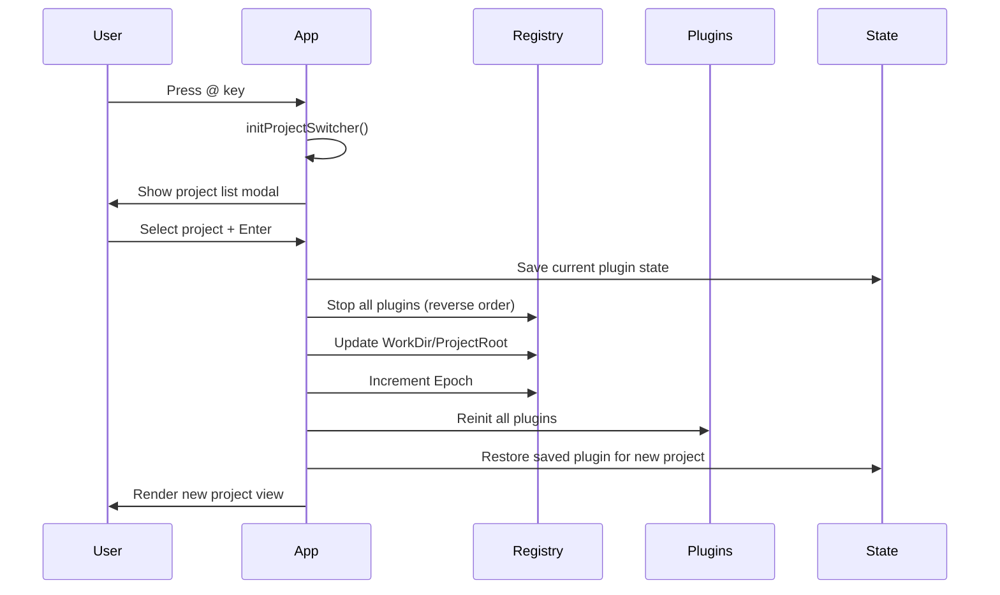
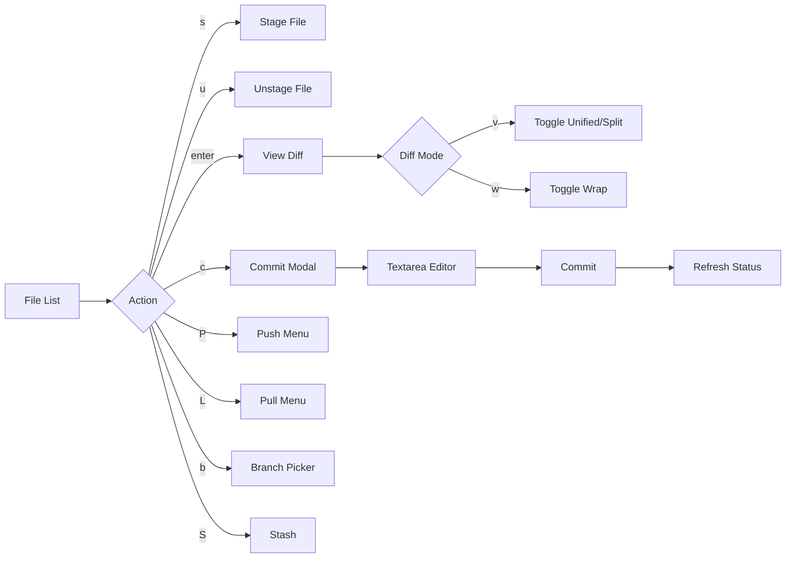

# Sidecar - Development Dashboard for CLI Agents

> **Source**: Fork of [marcus/sidecar](https://github.com/marcus/sidecar)
> **Category**: Development workflow dashboard for terminal
> **Technology**: Go, Bubble Tea, SQLite (TD), tmux integration

---

## Table of Contents

- [Overview](#overview)
- [Core Functionality](#core-functionality)
- [Architecture](#architecture)
- [User Flow](#user-flow)
- [Plugin System](#plugin-system)
- [UI Components & Screens](#ui-components--screens)
- [Technology Stack](#technology-stack)
- [TD Task Management](#td-task-management)
- [Integration Patterns](#integration-patterns)

---

## Overview

**Sidecar** is a terminal dashboard designed to run *alongside* CLI coding agents (not replace them). It centralizes development workflows: task planning (TD), git status monitoring, AI conversation history, file browsing, and workspace management—all in a single, tabbed TUI interface.

### Design Philosophy

> **"You might never open your editor again"**

Sidecar is built for split-terminal workflows:
```
┌─────────────────┬─────────────────┐
│                 │                 │
│  Claude Code    │    Sidecar      │
│  (Agent Left)   │  (Monitor Right)│
│                 │                 │
│  $ Make changes │  [Git] [Tasks]  │
│  $ Run commands │  [Files] [Chat] │
│                 │                 │
└─────────────────┴─────────────────┘
```

### What Makes Sidecar Unique

- **Complementary Tool**: Works *with* agents, not as one
- **Multi-Agent Support**: Aggregates conversations from Claude Code, Codex, Cursor, Gemini CLI, OpenCode, and more
- **TD Integration**: External memory system for cross-session context
- **Workspace Management**: Parallel development branches with isolated agents
- **Real-Time Monitoring**: Auto-refresh on file/git changes
- **Plugin Architecture**: 6 extensible plugins with unified message bus

---

## Core Functionality

### 1. Git Status Management (Tab 2)

Full git workflow without leaving the terminal:
- Real-time file tree (staged/modified/untracked)
- Syntax-highlighted diffs (inline or side-by-side)
- Rapid staging, committing, pushing, pulling
- Branch operations, stash management
- Conflict resolution UI
- Commit history with graph visualization

### 2. TD Task Management (Tab 1)

External memory for AI agents:
- Persistent task database (SQLite)
- Hierarchical issues and epics
- Session-based agent identity
- Handoff system for context transfer
- Review/approval workflow
- Never transmits data externally (local-first)

### 3. Conversations History (Tab 4)

Unified AI session browser:
- Aggregates from 10+ adapter types
- Session search and filtering
- Token usage analytics
- Message content search with highlighting
- Resume/export functionality
- Markdown rendering

### 4. File Browser (Tab 3)

Full file tree navigation:
- Syntax-highlighted preview
- Git status indicators
- Fuzzy file search (ctrl+p)
- Project-wide content search (ripgrep)
- Inline editor (tmux-based)
- Git blame integration
- Multi-tab support

### 5. Workspace Manager (Tab 5)

Git worktree orchestration:
- Parallel development in sibling directories
- Agent launching per worktree
- Kanban board view by status
- Shell session management
- Merge workflow with conflict detection
- Interactive tmux passthrough
- TD task linking

### 6. Notes Plugin (Tab 6)

Lightweight note-taking:
- Markdown notes with preview/edit modes
- Search and filtering
- Task creation from notes
- Archive and delete with undo
- Inline editor support

---

## Architecture

### Three-Layer System

```
┌─────────────────────────────────────────────────────┐
│              Root Bubble Tea Model                   │
│  app/model.go - State machine, modal priority       │
└──────────────────────┬──────────────────────────────┘
                       │
        ┌──────────────┼──────────────┐
        │              │              │
┌───────▼────┐  ┌──────▼─────┐  ┌────▼──────┐
│  Plugin    │  │   Modal    │  │  Keymap   │
│  Registry  │  │   System   │  │  Registry │
│  (6 plugins)│  │ (declarative)│ │ (contexts)│
└────────────┘  └────────────┘  └───────────┘
        │              │              │
┌───────▼──────────────▼──────────────▼──────────────┐
│          Event Bus (Message Broadcasting)          │
│  All plugins receive all messages (tea.Msg)        │
└────────────────────────────────────────────────────┘
```

### Data Flow

```
User Input (keyboard/mouse)
    ↓
handleKeyMsg() - Priority routing
    ├─ Active modal? → Modal.HandleKey()
    ├─ Interactive mode? → Plugin (all keys)
    ├─ Text input context? → Plugin (alphanumeric)
    ├─ Global shortcuts? → Toggle modals, switch plugins
    └─ Default → Active plugin.Update()
                    ↓
        Plugin processes message
                    ↓
        May emit messages for other plugins
                    ↓
        Broadcast to ALL plugins
                    ↓
        State updated, View() re-renders
```

### Plugin Communication

**Message Broadcasting Pattern**:
```go
// Plugin A emits a message
return plugin, tea.Cmd(func() tea.Msg {
    return NavigateToFileMsg{Path: "src/app.ts"}
})

// All plugins receive it in Update()
func (p *FileBrowserPlugin) Update(msg tea.Msg) (Plugin, tea.Cmd) {
    switch msg := msg.(type) {
    case NavigateToFileMsg:
        // File browser opens the file
        p.navigateToFile(msg.Path)
    }
    return p, nil
}
```

**Key Message Types**:
- `NavigateToFileMsg` - Open file in browser
- `FocusPluginByIDMsg` - Switch active plugin
- `SessionsLoadedMsg` - Conversations loaded
- `tea.WindowSizeMsg` - Terminal resize (broadcast to all)
- `app.OpenFullIssueMsg` - Open TD issue modal

---

## User Flow

### Application Launch Flow

```mermaid
graph TD
    A[main.go] --> B[Load Config]
    B --> C[Apply Theme]
    C --> D[Create Plugin Context]
    D --> E[Register 6 Plugins]
    E --> F[Call plugin.Init on all]
    F --> G[Restore Last Active Plugin]
    G --> H[Launch Bubble Tea Program]
    H --> I[Render Initial View]

    I --> J{User Action}
    J -->|1-6| K[Switch Plugin]
    J -->|@| L[Project Switcher]
    J -->|W| M[Worktree Switcher]
    J -->|#| N[Theme Switcher]
    J -->|i| O[Issue Input]
    J -->|!| P[Diagnostics Modal]
```

### Project Switching Flow



### Git Workflow Flow



### State Machine

```
┌──────────────────────────────────────────────────────────┐
│                     Root Model State                     │
│                                                          │
│  ┌─────────────┐                ┌──────────────────┐   │
│  │ Active      │                │ Modal Stack      │   │
│  │ Plugin      │◄───────────────┤ (priority order) │   │
│  │ (1 of 6)    │                └──────────────────┘   │
│  └─────────────┘                                        │
│                                                          │
│  Focus contexts determine input routing:                │
│  - Root contexts (q quits)                              │
│  - Text input contexts (alphanumeric forwarded)         │
│  - Interactive mode (ALL keys forwarded)                │
│                                                          │
└──────────────────────────────────────────────────────────┘
```

**Modal Priority** (highest to lowest):
1. Palette
2. Help
3. Update
4. Diagnostics
5. Quit Confirm
6. Project Switcher
7. Worktree Switcher
8. Theme Switcher
9. Issue Input
10. Issue Preview

---

## Plugin System

### Plugin Interface

**File**: [`ref/sidecar/internal/plugin/plugin.go`](ref/sidecar/internal/plugin/plugin.go:6-19)

Every plugin implements 13 methods:

```go
type Plugin interface {
    // Identity
    ID() string
    Name() string
    Icon() string

    // Lifecycle
    Init(ctx *Context) error
    Start() tea.Cmd
    Stop()

    // Elm Architecture
    Update(msg tea.Msg) (Plugin, tea.Cmd)
    View(width, height int) string

    // Focus
    IsFocused() bool
    SetFocused(bool)

    // Integration
    Commands() []Command
    FocusContext() string
}
```

### Plugin Context

**File**: [`ref/sidecar/internal/plugin/context.go`](ref/sidecar/internal/plugin/context.go:18-28)

Shared resources for all plugins:

```go
type Context struct {
    WorkDir      string              // Current working directory
    ProjectRoot  string              // Git repo root
    ConfigDir    string              // ~/.config/sidecar
    Config       *config.Config      // Global config
    Adapters     map[string]Adapter  // AI session adapters
    EventBus     *event.Dispatcher   // Cross-plugin events
    Logger       *slog.Logger        // Structured logging
    Keymap       *keymap.Registry    // Dynamic keybinding registration
    Epoch        uint64              // Project switch counter
}
```

**Epoch Pattern**: Invalidates stale async messages after project switches. Each async message stores the epoch when created; when it arrives, `IsStale()` compares to current epoch.

### Plugin Registry

**File**: [`ref/sidecar/internal/plugin/registry.go`](ref/sidecar/internal/plugin/registry.go)

**Lifecycle Methods**:
- `Register(plugin)` - Calls `Init()` with panic recovery; failed plugins added to `unavailable` map
- `Start()` - Calls `Start()` on all plugins, collects initial commands
- `Stop()` - Stops in **reverse** registration order
- `Reinit()` - Project switch: Stop all (reverse), update context, increment `Epoch`, re-init all

**Silent Degradation**: Failed plugins don't crash the app—they're marked unavailable and the app continues.

---

## UI Components & Screens

### 1. Application Shell

**Layout**: [`ref/sidecar/internal/app/view.go`](ref/sidecar/internal/app/view.go:33-99)

```
╔═════════════════════════════════════════════════════════════════╗
║ Sidecar / my-project [feat/new-feature]                     ⏰ ║
║                                                                 ║
║ [1 TD] [2 Git] [3 Files] [4 Chat] [5 Workspaces] [6 Notes]    ║
╠═════════════════════════════════════════════════════════════════╣
║                                                                 ║
║                    (Plugin Content Area)                        ║
║                                                                 ║
║                                                                 ║
║                                                                 ║
╠═════════════════════════════════════════════════════════════════╣
║ s stage · c commit · P push · ? palette · @ projects · r refresh
║ Toast: Changes saved • Last refresh: 2s ago                    ║
╚═════════════════════════════════════════════════════════════════╝
```

**Header** (2 rows):
- Line 1: App name, repo name, worktree indicator, centered tabs, optional clock
- Line 2: Spacing

**Content** (remaining - 3): Active plugin's `View()`

**Footer** (1 row):
- Context-aware key hints from active plugin + global hints
- Toast messages (info/error/success)
- Last refresh timestamp

### 2. Plugin: Git Status

**File**: [`ref/sidecar/internal/plugins/gitstatus/plugin.go`](ref/sidecar/internal/plugins/gitstatus/plugin.go)

```
╔═══════════════════════════════╦══════════════════════════════════╗
║ Files                         ║ Diff: src/App.tsx                ║
║                               ║ ────────────────────────────────  ║
║ Staged (2)                    ║                                   ║
║ ● src/App.tsx        +12 -3   ║  1 import React from 'react'      ║
║   src/theme.ts       +45 -12  ║  2 import { Theme } from './theme'║
║                               ║  3                                 ║
║ Modified (1)                  ║  4 function App() {               ║
║ ● src/utils.ts       +8  -2   ║  5 -  const theme = lightTheme    ║
║                               ║  6 +  const [theme, setTheme] =   ║
║ Untracked (1)                 ║  7 +    useState(lightTheme)      ║
║   tests/app.test.tsx          ║  8                                 ║
║                               ║  9    return (                     ║
║ ───────────────────────────── ║ 10      <ThemeProvider theme={    ║
║                               ║ 11 -      lightTheme              ║
║ Recent Commits                ║ 12 +      theme                   ║
║ a1b2c3d Add dark mode         ║ 13      }>                         ║
║ 4e5f6g7 Fix navbar            ║ 14        <App />                  ║
║ 8h9i0j1 Update deps           ║ 15      </ThemeProvider>           ║
║                               ║ 16    )                            ║
╠═══════════════════════════════╩══════════════════════════════════╣
║ s stage · u unstage · c commit · enter diff · P push · b branch ║
╚═════════════════════════════════════════════════════════════════╝
```

**Layout** (3 panes, 30/70 split):
- **Sidebar** (~30%): File tree + recent commits
- **Diff Pane** (~70%): Syntax-highlighted diff (unified or side-by-side)
- **Breadcrumb**: `Back > [commit] > filename [mode]` at top of diff pane

**View Modes**:
- `ViewModeStatus` (default): Three-pane layout
- `ViewModeDiff`: Full-screen or two-pane diff
- `ViewModeCommit`: Commit message editor
- `ViewModePushMenu`, `ViewModePullMenu`: Operation menus
- `ViewModeBranchPicker`: Filterable branch list
- `ViewModePullConflict`: Conflict resolution modal
- `ViewModeConfirmDiscard`, `ViewModeConfirmStashPop`: Confirmation dialogs

**Key Features**:
- Draggable sidebar width (persisted per project)
- Toggle unified/side-by-side diff (`v`)
- Horizontal scrolling for wide diffs
- Git graph visualization (`g`)
- Syntax highlighting for all file types
- Auto-refresh on filesystem changes (500ms debounce)

### 3. Plugin: TD Monitor

**File**: [`ref/sidecar/internal/plugins/tdmonitor/plugin.go`](ref/sidecar/internal/plugins/tdmonitor/plugin.go)

```
╔═════════════════════════════════════════════════════════════════╗
║ TD Monitor - Task Database                                      ║
╠═════════════════════════════════════════════════════════════════╣
║                                                                 ║
║ [Board View] [List View] [Epics]                               ║
║                                                                 ║
║ ┌──────────────┬──────────────┬──────────────┬──────────────┐ ║
║ │ Open (3)     │ In Progress  │ In Review    │ Closed (5)   │ ║
║ ├──────────────┼──────────────┼──────────────┼──────────────┤ ║
║ │              │              │              │              │ ║
║ │ [P1] AUTH-01 │ ● [P0] UI-12 │   [P1] API-3 │ [P2] DOC-1   │ ║
║ │ Implement    │ Dark Mode    │ Rate Limit   │ Update Guide │ ║
║ │ OAuth        │ Toggle       │ Middleware   │              │ ║
║ │              │ @alice       │ @bob         │              │ ║
║ │ [P2] API-05  │              │              │ [P3] TEST-2  │ ║
║ │ Add Webhook  │              │              │ E2E Tests    │ ║
║ │              │              │              │              │ ║
║ └──────────────┴──────────────┴──────────────┴──────────────┘ ║
║                                                                 ║
║ Focused: UI-12 - Dark Mode Toggle                              ║
║ Status: In Progress | Priority: P0 | Assigned: @alice          ║
║ Dependencies: AUTH-01 (open)                                    ║
║                                                                 ║
╠═════════════════════════════════════════════════════════════════╣
║ enter details · n new · s start · r review · a approve · w workspace
╚═════════════════════════════════════════════════════════════════╝
```

**Integration**: Wraps the external `td monitor` TUI as an embedded Bubble Tea model

**Key Features**:
- **Board/List/Epics views**: Toggle between visualizations
- **Status lifecycle**: open → in_progress → in_review → closed
- **Priority levels**: P0 (critical) → P3 (low)
- **Dependencies**: Task graph with blocking relationships
- **Handoff system**: Captures done/remaining/decisions/uncertain
- **Send to workspace**: Routes task to Workspaces plugin for agent work
- **Session tracking**: Unique ID per (branch + agent type)

**Database**: `.todos/db.sqlite` (local, never external)

### 4. Plugin: Conversations

**File**: [`ref/sidecar/internal/plugins/conversations/plugin.go`](ref/sidecar/internal/plugins/conversations/plugin.go)

```
╔═══════════════════════════════╦══════════════════════════════════╗
║ Sessions                      ║ Conversation                      ║
║                               ║ ──────────────────────────────────║
║ [All] [Claude] [Cursor]       ║                                   ║
║                               ║ You:                              ║
║ ● Today (3)                   ║ Add a dark mode toggle to the nav ║
║   Dark Mode Feature           ║                                   ║
║   Claude Code • 2h ago        ║ Assistant:                        ║
║   45K tokens • $0.12          ║ I'll add a dark mode toggle. Let  ║
║                               ║ me first check the current theme  ║
║   Fix navbar bug              ║ implementation...                 ║
║   Cursor • 5h ago             ║                                   ║
║   12K tokens • $0.03          ║ [Tool] Grep "theme" src/**/*.ts   ║
║                               ║ Found 3 files with theme imports  ║
║   Update dependencies         ║                                   ║
║   Codex • 1d ago              ║ [Show More]                       ║
║   8K tokens • $0.02           ║                                   ║
║                               ║ Assistant:                        ║
║ ● Yesterday (2)               ║ I found the theme system. Here's  ║
║   Authentication refactor     ║ my implementation plan:           ║
║   Claude Code • 1d ago        ║                                   ║
║   120K tokens • $0.89         ║ 1. Add toggle component           ║
║                               ║ 2. Connect to theme context       ║
║   Database migration          ║ 3. Store preference in localStorage
║   Gemini CLI • 2d ago         ║                                   ║
║   34K tokens • $0.08          ║ [Tool] Write src/ThemeToggle.tsx  ║
║                               ║ Creating new file...              ║
╠═══════════════════════════════╩══════════════════════════════════╣
║ enter view · / search · e export · i resume · tab sidebar       ║
╚═════════════════════════════════════════════════════════════════╝
```

**Layout** (2 panes, 30/70 split):
- **Sidebar** (~30%): Session list grouped by date, filterable by adapter
- **Main Pane** (~70%): Message flow (conversation or turn-based view)

**Supported Adapters** (10):
1. Claude Code (`~/.config/claude/conversations/*.jsonl`)
2. Codex (`~/.codex/sessions/*.json`)
3. Cursor CLI (`~/.cursor/history/*.json`)
4. Gemini CLI (`~/.gemini/conversations/*.json`)
5. OpenCode (`~/.opencode/sessions/*.jsonl`)
6. Amp Code (`~/.amp/history/*.json`)
7. Kiro (`~/.kiro/sessions/*.json`)
8. Warp (`~/.warp/ai_history/*.json`)
9. PI (`~/.pi/conversations/*.json`)
10. Cache (generic JSONL adapter)

**Key Features**:
- **Session search**: Filter by name/summary (line 1)
- **Content search**: Full-text search within messages with match highlighting
- **Analytics view**: Token usage, cost breakdown, model distribution
- **Resume modal**: Continue sessions in original agent
- **Export**: Markdown export of full conversations
- **Real-time updates**: File watchers detect new messages

### 5. Plugin: File Browser

**File**: [`ref/sidecar/internal/plugins/filebrowser/plugin.go`](ref/sidecar/internal/plugins/filebrowser/plugin.go)

```
╔═══════════════════════════════╦══════════════════════════════════╗
║ Files                         ║ Preview: src/App.tsx [typescript] ║
║                               ║ ──────────────────────────────────║
║ [Tree] [Tabs: App.tsx ×]      ║                                   ║
║                               ║   1 import React, { useState } from
║ ▼ src/                        ║   2 import { Theme } from './theme'
║   ▼ components/               ║   3                               ║
║     ● Navbar.tsx       M      ║   4 function App() {              ║
║       Button.tsx              ║   5   const [theme, setTheme] =   ║
║     ▼ forms/                  ║   6     useState(lightTheme)      ║
║         Input.tsx             ║   7                               ║
║         Select.tsx            ║   8   const toggleTheme = () => { ║
║   ▼ hooks/                    ║   9     setTheme(theme === light  ║
║       useTheme.ts       A     ║  10       ? darkTheme             ║
║       useAuth.ts              ║  11       : lightTheme            ║
║   ● App.tsx            M      ║  12     )                         ║
║   ● theme.ts           M      ║  13   }                           ║
║   styles.css                  ║  14                               ║
║ ▼ tests/                      ║  15   return (                    ║
║     app.test.tsx        ?     ║  16     <ThemeProvider theme={    ║
║                               ║  17       theme                   ║
║ Git Status Legend:            ║  18     }>                        ║
║ M Modified  A Added           ║  19       <Navbar                 ║
║ D Deleted   ? Untracked       ║  20         onToggleTheme={toggle ║
║                               ║  21       />                      ║
║                               ║  22       <MainContent />         ║
╠═══════════════════════════════╩══════════════════════════════════╣
║ enter open · ctrl+p find · ctrl+s search · e edit · b blame · tab pane
╚═════════════════════════════════════════════════════════════════╝
```

**Layout** (2 panes, 30/70 split):
- **Tree Pane** (~30%): Collapsible directory tree with git status icons
- **Preview Pane** (~70%): Syntax-highlighted file content with line numbers

**View Modes**:
- **Preview Mode** (default): Read-only with syntax highlighting
- **Edit Mode**: Bubbles textarea for direct editing
- **Inline Edit**: Full tmux-based editor session within pane
- **Blame View**: Git blame annotations alongside code

**Search Modes**:
1. **Filename Search** (`/`): Filter tree entries by name
2. **Content Search** (`/` in preview): Search within file, n/N navigation
3. **Quick Open** (`ctrl+p`): Fuzzy file finder across project (50K file cache)
4. **Project Search** (`ctrl+s`): Ripgrep full-text search

**Key Features**:
- **Multi-tab support**: Open multiple files, close with `x`
- **Git integration**: Status indicators (M/A/D/?), blame view
- **Markdown rendering**: Toggle raw/rendered with `m`
- **Image preview**: Sixel/Kitty graphics protocol support
- **Gitignore respect**: Hidden files automatically filtered
- **File operations**: Move, rename, create, delete via inline commands

### 6. Plugin: Workspaces

**File**: [`ref/sidecar/internal/plugins/workspace/plugin.go`](ref/sidecar/internal/plugins/workspace/plugin.go)

```
╔═══════════════════════════════╦══════════════════════════════════╗
║ Workspaces                    ║ Preview: feat/dark-mode           ║
║                               ║ ──────────────────────────────────║
║ [List] [Kanban]               ║ [Output] [Diff] [Task]           ║
║                               ║                                   ║
║ ● feat/dark-mode       ⚡     ║ ┌────────────────────────────────┐
║   Agent: Claude Code          ║ │ $ npx claude                   │
║   Branch: feat/dark-mode      ║ │                                │
║   Status: Thinking            ║ │ I'll implement the dark mode   │
║   Task: UI-12 (linked)        ║ │ toggle. Let me start by adding │
║   Updated: 2m ago             ║ │ the theme context...           │
║                               ║ │                                │
║   fix/navbar-bug       ⏸️     ║ │ [Reading src/theme.ts...]      │
║   Agent: None                 ║ │                                │
║   Branch: fix/navbar          ║ │ I see you have a light theme.  │
║   Status: Paused              ║ │ I'll add a dark theme and      │
║   Task: None                  ║ │ toggle component.              │
║                               ║ │                                │
║   refactor/auth        ✅     ║ │ [Tool] Write ThemeToggle.tsx   │
║   Agent: Codex                ║ │ Creating component...          │
║   Branch: refactor/auth       ║ │                                │
║   Status: Done                ║ │ Done! The toggle is in the     │
║   Task: AUTH-01 (complete)    ║ │ navbar. Try it out.            │
║                               ║ │                                │
║   chore/deps          💤     ║ │ $                              │
║   Shell: maintenance          ║ └────────────────────────────────┘
║   Branch: chore/deps          ║                                   ║
║   Status: Waiting             ║                                   ║
╠═══════════════════════════════╩══════════════════════════════════╣
║ enter agent · n new · i interactive · m merge · d delete · v kanban
╚═════════════════════════════════════════════════════════════════╝
```

**Layout** (2 panes, 40/60 split):
- **List Pane** (~40%): Worktree list with status indicators
- **Preview Pane** (~60%): Three tabs (Output, Diff, Task)

**View Modes**:
- `ViewModeList` (default): Worktree list + preview
- `ViewModeKanban`: Columns organized by status (Active, Thinking, Waiting, Done, Paused)
- `ViewModeInteractive`: Full tmux passthrough (ALL keys forwarded to agent/shell)
- `ViewModeCreate`: New worktree creation modal
- `ViewModeMerge`: Multi-step merge workflow
- `ViewModeAgentChoice`: Attach vs restart decision

**Status Icons**:
- ⚡ `Active` (agent running)
- 🤔 `Thinking` (agent processing)
- ⏳ `Waiting` (agent waiting for input)
- ✅ `Done` (completed)
- ⏸️ `Paused` (inactive)
- ❌ `Error` (failed)

**Key Features**:
- **Git worktree integration**: Creates parallel branches as sibling directories
- **Agent launching**: Spawn Claude Code, Codex, Cursor, etc. within worktree
- **Interactive mode**: Enter agent session with full keyboard passthrough
- **Shell management**: Standalone tmux sessions (not agent-tied)
- **Merge workflow**: Multi-step process with conflict detection
- **TD task linking**: Connect worktrees to TD tasks
- **Kanban board**: Drag-free column view organized by status

**Kanban Board Layout**:
```
╔════════════════════════════════════════════════════════════════════════╗
║ [Shells]  [Active]  [Thinking]  [Waiting]  [Done]  [Paused]           ║
╠════════════════════════════════════════════════════════════════════════╣
║                                                                        ║
║ ┌─────┐   ┌─────┐   ┌─────┐    ┌─────┐   ┌─────┐   ┌─────┐          ║
║ │deps │   │dark-│   │auth │    │api  │   │docs │   │test │          ║
║ │     │   │mode │   │     │    │     │   │     │   │     │          ║
║ │💤   │   │⚡   │   │🤔   │    │⏳   │   │✅   │   │⏸️   │          ║
║ └─────┘   └─────┘   └─────┘    └─────┘   └─────┘   └─────┘          ║
║                                                                        ║
║           ┌─────┐                                                     ║
║           │nav  │                                                     ║
║           │fix  │                                                     ║
║           │⚡   │                                                     ║
║           └─────┘                                                     ║
║                                                                        ║
╠════════════════════════════════════════════════════════════════════════╣
║ ↑↓←→ navigate · enter details · i interactive · m merge               ║
╚════════════════════════════════════════════════════════════════════════╝
```

### 7. Modal System

**File**: [`ref/sidecar/internal/modal/modal.go`](ref/sidecar/internal/modal/modal.go)

**Declarative Builder Pattern**:
```go
modal.New("Quit Sidecar?",
    modal.WithWidth(50),
    modal.WithVariant(modal.Danger),
    modal.WithPrimaryAction("quit"),
).
    AddSection(modal.Text("Are you sure you want to quit?")).
    AddSection(modal.Spacer()).
    AddSection(modal.Buttons(
        modal.Btn(" Quit ", "quit"),
        modal.Btn(" Cancel ", "cancel"),
    ))
```

**Section Types**:
- `Text(s)` - Word-wrapped static text
- `Spacer()` - Blank line
- `When(condition, section)` - Conditional rendering
- `Custom(renderFn, updateFn)` - Escape hatch
- `Buttons(btns...)` - Focusable button row
- `Checkbox(id, label, checked)` - Toggle
- `Input(id, &textinput)` - Text field

**Rendering**:
```
╔═════════════════════════════════════════════════════════════════╗
║                                                                 ║
║   ┌─────────────────────────────────────────────────────┐     ║
║   │ Modal Title                                          │     ║
║   │ ───────────────────────────────────────────────────  │     ║
║   │                                                      │     ║
║   │ Section 1 content with word wrapping when text is   │     ║
║   │ too long for the modal width.                       │     ║
║   │                                                      │     ║
║   │ [ ] Checkbox option 1                               │     ║
║   │ [✓] Checkbox option 2                               │     ║
║   │                                                      │     ║
║   │ ┌────────────────────────────────────────────────┐  │     ║
║   │ │ Input: [text input field___________________]   │  │     ║
║   │ └────────────────────────────────────────────────┘  │     ║
║   │                                                      │     ║
║   │ ┌────────────────────────────────────────────────┐  │     ║
║   │ │ [ Primary ] [ Secondary ]                      │  │     ║
║   │ └────────────────────────────────────────────────┘  │     ║
║   │                                                      │     ║
║   │ [Tab] Focus  [Enter] Submit  [Esc] Cancel          │     ║
║   └─────────────────────────────────────────────────────┘     ║
║                                                                 ║
╚═════════════════════════════════════════════════════════════════╝
```

**Key Features**:
- **Focus management**: Tab/Shift+Tab cycle through focusable elements
- **Scrollbar**: Auto-added when content exceeds viewport
- **Mouse support**: Click to focus, scroll wheel for content
- **Hit regions**: Backdrop dismiss, element activation
- **Variants**: Default, Danger, Warning, Info (colored borders/accents)

### 8. Theme System

**File**: [`ref/sidecar/internal/theme/resolve.go`](ref/sidecar/internal/theme/resolve.go)

**Resolution Priority**:
1. Project-specific theme (`.sidecar/theme.json`)
2. Global theme (`~/.config/sidecar/theme.json`)
3. Default theme (built-in)

**453 Community Themes** ([iTerm2-Color-Schemes](https://github.com/mbadolato/iTerm2-Color-Schemes)):
- Dracula, Solarized, Monokai, Nord, Gruvbox, One Dark, etc.
- Live preview in theme switcher
- Per-project or global scope
- Instant switch without restart

**Theme Switcher** (`#` key):
```
╔═════════════════════════════════════════════════════════════════╗
║                                                                 ║
║   ┌─────────────────────────────────────────────────────┐     ║
║   │ Theme Switcher                                       │     ║
║   │ ───────────────────────────────────────────────────  │     ║
║   │                                                      │     ║
║   │ Scope: ● Project    ○ Global       [ctrl+s toggle]  │     ║
║   │                                                      │     ║
║   │ ┌────────────────────────────────────────────────┐  │     ║
║   │ │ Search: [dracula_________________]             │  │     ║
║   │ └────────────────────────────────────────────────┘  │     ║
║   │                                                      │     ║
║   │ Built-in Themes                                     │     ║
║   │ ● Default                                           │     ║
║   │   Dracula                                           │     ║
║   │                                                      │     ║
║   │ Community Themes (453)                              │     ║
║   │   3024 Day                                          │     ║
║   │   3024 Night                                        │     ║
║   │   Afterglow                                         │     ║
║   │   Alabaster                                         │     ║
║   │   [... 449 more ...]                                │     ║
║   │                                                      │     ║
║   │ [↑↓] Navigate  [Enter] Apply  [Esc] Cancel         │     ║
║   └─────────────────────────────────────────────────────┘     ║
║                                                                 ║
╚═════════════════════════════════════════════════════════════════╝
```

---

## Technology Stack

### Core Technologies

| Category | Technology | Purpose |
|----------|-----------|---------|
| **Language** | Go (92%) | Core application |
| **UI Framework** | Bubble Tea | Terminal UI (Elm Architecture) |
| **Styling** | Lipgloss | Colors, borders, layouts |
| **CLI** | Cobra | Command structure |
| **Database** | SQLite (TD) | Task persistence |
| **Terminal** | tmux | PTY sessions for agents/editors |
| **Build** | Make + goreleaser | Build automation |

### Supporting Technologies

- **Web** (HTML/JS/CSS 6%): Documentation site (Docusaurus)
- **Animation**: Spring physics (Harmonica-style)
- **Syntax Highlighting**: Chroma
- **Markdown**: Glamour
- **Git**: Native go-git library + git CLI
- **File Watching**: fsnotify

### Database (TD)

**Schema** (`.todos/db.sqlite`):
```sql
CREATE TABLE issues (
    id TEXT PRIMARY KEY,
    epic_id TEXT,
    type TEXT, -- feature, bug, chore, docs, refactor, test
    title TEXT,
    description TEXT,
    status TEXT, -- open, in_progress, in_review, closed, blocked
    priority TEXT, -- P0, P1, P2, P3
    created_at INTEGER,
    updated_at INTEGER,
    closed_at INTEGER,
    assignee TEXT,
    FOREIGN KEY (epic_id) REFERENCES epics(id)
);

CREATE TABLE epics (
    id TEXT PRIMARY KEY,
    title TEXT,
    description TEXT,
    status TEXT,
    created_at INTEGER
);

CREATE TABLE dependencies (
    issue_id TEXT,
    depends_on TEXT,
    FOREIGN KEY (issue_id) REFERENCES issues(id),
    FOREIGN KEY (depends_on) REFERENCES issues(id)
);

CREATE TABLE handoffs (
    id INTEGER PRIMARY KEY,
    issue_id TEXT,
    session_id TEXT,
    done TEXT,
    remaining TEXT,
    decisions TEXT,
    uncertain TEXT,
    created_at INTEGER,
    FOREIGN KEY (issue_id) REFERENCES issues(id)
);
```

---

## TD Task Management

### Core Concepts

**External Memory**: Persistent storage for agent context across sessions, solving the "agent amnesia" problem when context windows end.

**Session Identity**: Unique ID = `{branch}-{agent_type}` (e.g., `feat/auth-claude-code`). Same agent on same branch = consistent identity for reliable resumption.

**Handoff System**: Structured context transfer between sessions.

### Essential Commands

**Basic Workflow**:
```bash
td create               # Create new issue
td start <id>           # Start work on issue
td focus <id>           # Set as current focus
td review <id>          # Submit for review
td approve <id>         # Approve reviewed work
td reject <id>          # Reject and send back
td close <id>           # Mark as closed
```

**Handoff**:
```bash
td handoff <id> \
  --done "Implemented OAuth flow, added tests" \
  --remaining "Need to add refresh token logic" \
  --decision "Using JWT instead of sessions for better scaling" \
  --uncertain "Not sure if we need rate limiting yet"
```

**Dependencies**:
```bash
td depends <id> <dependency_id>   # Add dependency
td unblock <id>                   # Mark blocker as resolved
```

**Query**:
```bash
td ls                   # List all open issues
td ls --mine            # Issues assigned to me
td ls --epic <epic_id>  # Issues in epic
td ls --blocked         # Blocked issues
```

### Workflow Integration

**Agent Workflow**:
1. Agent starts → `td usage --new-session` (view open work)
2. No task? → `td` (shows interactive task selection)
3. Task found? → `td start <id>`
4. Work proceeds...
5. Context ends? → `td handoff <id> --done "..." --remaining "..."`
6. New session → `td resume <id>` (reads handoff)
7. Work completes → `td review <id>`
8. Review? → `td approve <id>` OR `td reject <id>`

**Review Enforcement**: "The session that implements code cannot approve it" - forces handoff/review cycle.

---

## Integration Patterns

### For Prism Plugin

#### 1. Plugin-Based Architecture

**Pattern**: Extensible plugin system with unified message bus
```
Benefits:
- Modular features (easy to add/remove)
- Loose coupling via message passing
- Isolated state per plugin
- Graceful degradation (failed plugins don't crash app)

Implementation:
plugins/
├── registry.go (lifecycle management)
├── plugin.go (interface definition)
└── <plugin>/ (implementations)
    ├── plugin.go
    ├── view.go
    └── update.go
```

#### 2. Multi-Adapter System

**Pattern**: Abstract conversation sources via adapter interface
```
Benefits:
- Support multiple AI agents simultaneously
- Unified history across tools
- Easy to add new agent types
- Real-time updates via file watching

Implementation:
adapters/
├── adapter.go (interface)
├── search.go (cross-adapter search)
├── detect.go (auto-detection)
└── <agent>/ (implementations)
    ├── adapter.go
    ├── parser.go
    ├── watcher.go
    └── types.go
```

#### 3. Context-Driven Input Routing

**Pattern**: Dynamic key handling based on UI state
```
Benefits:
- Same keys do different things in different contexts
- Text input vs navigation modes
- Interactive passthrough mode
- Consistent user expectations

Implementation:
Contexts:
- Root contexts (q quits, alphanumeric is shortcut)
- Text input contexts (alphanumeric types)
- Interactive contexts (ALL keys forwarded)

Check: plugin.FocusContext() → keymap.Get(context)
```

#### 4. Declarative Modal System

**Pattern**: Build modals from composable sections
```
Benefits:
- Consistent UI/UX across modals
- Automatic focus management
- Built-in scrollbar/overflow handling
- Mouse support out of the box

Implementation:
modal.New(title, opts...).
    AddSection(modal.Text("...")).
    AddSection(modal.Buttons(...)).
    AddSection(modal.Checkbox(...))
```

#### 5. TD-Style External Memory

**Pattern**: SQLite database for persistent agent context
```
Benefits:
- Survives context window resets
- Structured work state
- Session identity for resumption
- Handoff system for context transfer
- No external transmission (local-first)

Implementation:
.prism/
├── tasks.db (SQLite)
└── schema:
    ├── issues (tasks)
    ├── epics (groups)
    ├── dependencies (graph)
    └── handoffs (context transfer)
```

#### 6. Project-Scoped State

**Pattern**: Per-project persistent UI state
```
Benefits:
- Remember UI state per project
- Smooth project switching
- Isolated configurations
- No global pollution

Implementation:
~/.config/sidecar/state/
└── <project-hash>.json
    ├── activePlugin
    ├── sidebarWidth
    ├── expandedDirs
    └── cursorPositions
```

---

## Build & Development

**Build Commands** ([`ref/sidecar/Makefile`](ref/sidecar/Makefile)):
```bash
make build              # Build to ./bin/sidecar
make test              # Run tests
make fmt               # Format code
make fmt-check         # Check formatting (CI)
make lint              # Lint new issues only
make lint-all          # Lint everything
make install-dev       # Install to GOPATH/bin
make tag               # Create git tag (semver)
```

**Project Structure**:
```
sidecar/
├── cmd/sidecar/            # Entry point
├── internal/
│   ├── app/               # Root Bubble Tea model
│   ├── plugin/            # Plugin system
│   ├── plugins/           # 6 plugin implementations
│   ├── adapter/           # AI session adapters
│   ├── modal/             # Declarative modal system
│   ├── ui/                # Reusable components
│   ├── keymap/            # Key binding registry
│   ├── styles/            # Lipgloss theming
│   └── tty/               # tmux PTY integration
├── configs/               # Default config
└── docs/                  # Documentation
```

---

## Key Takeaways

### What Sidecar Does Well

1. **Complementary Design**: Works alongside agents, doesn't compete with them
2. **Plugin Architecture**: Modular, extensible, gracefully degrading
3. **Multi-Agent Support**: Aggregates from 10+ different CLI agents
4. **TD Integration**: Solves context window problem with external memory
5. **Real-Time Monitoring**: Auto-refresh keeps UI in sync with file system
6. **Workspace Management**: Parallel development with isolated agents
7. **Declarative Modals**: Composable UI with automatic focus management

### Prism Integration Opportunities

1. **Adopt plugin architecture** for modular Prism features
2. **Implement TD-style task system** for cross-session context
3. **Support multi-adapter pattern** for aggregating agent history
4. **Use declarative modal builder** for consistent UI
5. **Context-driven input routing** for flexible key handling
6. **Project-scoped state persistence** for smooth switching
7. **Workspace-style worktree manager** for parallel development

---

## References

- **Repository**: https://github.com/marcus/sidecar
- **Website**: https://sidecar.haplab.com
- **TD Documentation**: https://sidecar.haplab.com/docs/td
- **Agent Integration**: https://github.com/marcus/sidecar/blob/main/AGENTS.md
- **Bubble Tea Framework**: https://github.com/charmbracelet/bubbletea

---

*Documentation generated from fork at [`ref/sidecar/`](ref/sidecar/) on 2026-02-11*
