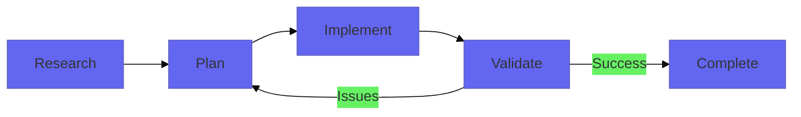

# Prism Plugin Update Instructions

## 🎯 Quick Reference: Ralph → Spectrum Migration

| Old (Ralph) | New (Spectrum) | Reason |
|-------------|----------------|---------|
| `ralph.sh` | `spectrum.sh` | Better branding alignment |
| `/prism:prism-ralph` | `/prism:prism-spectrum` | Thematic consistency |
| `thoughts/shared/ralph/` | `.prism/shared/spectrum/` | Clearer structure |
| `thoughts/shared/ralph/stories.json` | `.prism/stories/stories.json` | Separated stories from execution state |
| `thoughts/shared/ralph/progress.md` | `.prism/shared/spectrum/progress.md` | Execution state stays with spectrum |
| "Ralph autonomous execution" | "Spectrum autonomous execution" | Light through prism → spectrum |
| `ralph-tui` | `prism-cli` | Product cohesion |
| `cmd/ralph-tui/` | `cmd/prism-cli/` | Binary and directory rename |

**Why Spectrum?** Light through a prism creates a spectrum. Your feature, decomposed into a full spectrum of atomic stories. Perfect thematic fit! 🌈

**Key Architectural Change**: `stories.json` now lives in its own directory (`.prism/stories/`) separate from execution state (`.prism/shared/spectrum/progress.md`). This allows multiple Spectrum runs to reference the same story definitions.

---

## Phase 1: Namespace Brainstorming & Renaming

### 1.1 Selected Namespace: **spectrum** ✅

**Rationale**: Perfect thematic alignment with Prism
- Light through a prism creates a spectrum
- Implies completeness (full spectrum of stories)
- Professional and memorable
- Works beautifully in commands: `/prism:prism-spectrum`

**Tagline ideas**:
- "Stories span the spectrum"
- "Execute across the full spectrum"
- "Development spectrum orchestration"

**How it looks in practice**:
```bash
# Command usage
/prism:prism-spectrum

# Script execution
./scripts/spectrum.sh

# Directory structure
.prism/shared/spectrum/
├── stories.json
└── progress.md

# TUI launch
prism-cli --follow spectrum

# Git commit messages
"spectrum: Complete story 3/10 - Password reset flow"
```

### 1.2 Global Rename: ralph → spectrum
**Files to update**:

1. **README.md**
   - Section headers (line 52, 169)
   - All command references (`/prism:prism-ralph`)
   - Script references (`ralph.sh`)
   - Directory references (`thoughts/shared/ralph/`)
   - Text descriptions

2. **Plugin structure**
   ```
   skills/prism/
   ├── commands/
   │   └── prism-ralph.md → prism-spectrum.md
   ├── skills/
   │   └── prism-ralph.md → prism-spectrum.md
   └── agents/
       └── (check for ralph references)
   ```

3. **Scripts**
   ```
   scripts/
   └── ralph.sh → spectrum.sh
   ```

4. **Internal references**
   - All skill/command YAML frontmatter
   - All cross-references in documentation
   - Variable names in scripts
   - Function names

**Search commands to run**:
```bash
# Find all files containing "ralph"
grep -r "ralph" skills/prism/ --include="*.md" --include="*.py" --include="*.sh"
grep -r "Ralph" skills/prism/ --include="*.md" --include="*.py" --include="*.sh"
grep -r "RALPH" skills/prism/ --include="*.md" --include="*.py" --include="*.sh"
```

### 1.3 Rename ralph-tui → prism-cli
**Rationale**: Better branding alignment, clearer that it's part of Prism ecosystem

**Files to update**:
- Tool name references
- Installation instructions
- Command invocations
- Documentation

---

## Phase 2: Directory Structure Migration

### 2.1 Create `/prism-dir-update` Command

**Purpose**: Migrate existing Prism projects from old structure to new

**Command specification**:
```yaml
---
name: prism-dir-update
description: Migrate existing Prism project to new directory structure
triggers:
  - patterns:
    - "migrate prism structure"
    - "update prism directories"
---
```

**Migration logic**:
1. Check if `thoughts/` directory exists
2. If exists:
   - Create `.prism/` directory
   - Create `.prism/stories/` directory
   - Move `thoughts/shared/ralph/stories.json` → `.prism/stories/stories.json`
   - Create `.prism/shared/spectrum/` directory
   - Move `thoughts/shared/ralph/progress.md` → `.prism/shared/spectrum/progress.md`
   - Move other `thoughts/shared/*` directories → `.prism/shared/`
   - Move `thoughts/local/*` → `.prism/local/`
   - Create `.prism/shared/ref/` and `.prism/shared/docs/`
   - Create `.prism/local/ref/` and `.prism/local/docs/`
3. If `ref/` exists at project root → move to `.prism/shared/ref/`
4. If `docs/` exists at project root → move to `.prism/shared/docs/`
5. Update `.gitignore` file
6. Generate migration report with file counts and new structure

**Special handling for stories.json and progress.md**:
```python
# In migration script
def migrate_ralph_to_spectrum(thoughts_dir: Path, prism_dir: Path):
    """Migrate Ralph execution state to new Spectrum structure."""
    ralph_dir = thoughts_dir / "shared" / "ralph"
    
    if ralph_dir.exists():
        # Separate stories.json into its own directory
        stories_file = ralph_dir / "stories.json"
        if stories_file.exists():
            stories_dir = prism_dir / "stories"
            stories_dir.mkdir(parents=True, exist_ok=True)
            shutil.copy2(stories_file, stories_dir / "stories.json")
            print(f"✓ Migrated stories.json to .prism/stories/")
        
        # Keep progress.md in spectrum execution directory
        progress_file = ralph_dir / "progress.md"
        if progress_file.exists():
            spectrum_dir = prism_dir / "shared" / "spectrum"
            spectrum_dir.mkdir(parents=True, exist_ok=True)
            shutil.copy2(progress_file, spectrum_dir / "progress.md")
            print(f"✓ Migrated progress.md to .prism/shared/spectrum/")
```

**Error handling**:
- Backup `thoughts/` to `thoughts.backup/` before migration
- Verify all files copied successfully
- Option to rollback if issues detected

### 2.2 New Directory Structure

**Key Architectural Change**: Separate `stories.json` from execution state

**Current structure (Ralph)**:
```
project/
└── thoughts/
    └── shared/
        └── ralph/
            ├── stories.json    # ← Task definitions
            └── progress.md     # ← Accumulated learnings
```

**New structure (Spectrum)**:
```
project/
├── .prism/
│   ├── stories/               # 🆕 Separate stories directory
│   │   └── stories.json       # Task definitions (shared across runs)
│   └── shared/                # Committed to repo
│       ├── research/          # YYYY-MM-DD-topic.md
│       ├── plans/             # YYYY-MM-DD-feature.md
│       ├── validation/        # YYYY-MM-DD-report.md
│       ├── handoffs/          # Session handoff docs
│       ├── prs/               # PR descriptions
│       ├── spectrum/          # Execution state per run
│       │   └── progress.md    # Accumulated learnings
│       ├── ref/               # 🆕 Reference materials
│       └── docs/              # 🆕 Project documentation
│       └── local/             # Gitignored
│           ├── ref/           # 🆕 Personal reference materials
│           └── docs/          # 🆕 Personal notes
└── .gitignore                 # Updated to ignore .prism/local/
```

**Rationale for separation**:
- `stories.json` is the **source of truth** for task definitions (rarely changes)
- `progress.md` is **execution state** (updated every iteration)
- Separating allows multiple Spectrum runs to reference same stories
- Cleaner mental model: stories = what to do, progress = what we learned

### 2.3 Update init_thoughts.py → init_prism.py

**Rename and update**:
```python
# skills/prism/scripts/init_prism.py

STRUCTURE = {
    '.prism': {
        'stories': {},         # NEW - Separate directory for stories.json
        'shared': {
            'research': {},
            'plans': {},
            'validation': {},
            'handoffs': {},
            'prs': {},
            'spectrum': {},    # Execution state (progress.md)
            'ref': {},         # NEW
            'docs': {}         # NEW
        },
        'local': {
            'ref': {},         # NEW
            'docs': {}         # NEW
        }
    }
}

def create_structure(base_path: Path = Path('.')):
    """Create the .prism directory structure."""
    # Create all directories
    for dir_path in get_all_dirs(STRUCTURE):
        full_path = base_path / dir_path
        full_path.mkdir(parents=True, exist_ok=True)
    
    # Create README files
    create_readme(base_path / '.prism' / 'stories', 
                  "Story definitions (stories.json)")
    create_readme(base_path / '.prism' / 'shared' / 'spectrum', 
                  "Spectrum execution state (progress.md)")
    # ... other READMEs
```

**README template for each folder**:
- `.prism/shared/ref/README.md`: "Shared reference materials for the team"
- `.prism/shared/docs/README.md`: "Project-wide documentation"
- `.prism/local/ref/README.md`: "Personal reference materials (not committed)"
- `.prism/local/docs/README.md`: "Personal notes and scratch work (not committed)"

### 2.4 Update .gitignore Recommendations

**Document in README**:
```gitignore
# Prism - ignore local artifacts
.prism/local/

# Optional: if ref/ and docs/ contain sensitive info
.prism/shared/ref/
.prism/shared/docs/
```

**Note**: Provide clear guidance on when to gitignore shared vs local ref/docs

### 2.5 Update TUI Code for New Path Structure

**Files to update**: `cmd/ralph-tui/` → `cmd/prism-cli/`

**Path changes needed**:

1. **Rename directory**:
   ```bash
   mv cmd/ralph-tui cmd/prism-cli
   ```

2. **Update path constants** (in Go source files):
   ```go
   // OLD paths
   const (
       RalphDir     = "thoughts/shared/ralph"
       StoriesFile  = "thoughts/shared/ralph/stories.json"
       ProgressFile = "thoughts/shared/ralph/progress.md"
   )
   
   // NEW paths
   const (
       PrismDir      = ".prism"
       StoriesFile   = ".prism/stories/stories.json"        // ← Separated
       ProgressFile  = ".prism/shared/spectrum/progress.md" // ← In spectrum/
       SpectrumDir   = ".prism/shared/spectrum"
   )
   ```

3. **Update file watchers**:
   ```go
   // Watch both locations for changes
   func (m *Model) watchFiles() {
       // Watch stories.json for task updates
       m.watchFile(".prism/stories/stories.json", m.onStoriesChange)
       
       // Watch progress.md for execution updates
       m.watchFile(".prism/shared/spectrum/progress.md", m.onProgressChange)
   }
   ```

4. **Update data loaders**:
   ```go
   // Load stories from new location
   func loadStories() (*Stories, error) {
       data, err := os.ReadFile(".prism/stories/stories.json")
       if err != nil {
           return nil, fmt.Errorf("failed to read stories: %w", err)
       }
       // ... parse and return
   }
   
   // Load progress from new location
   func loadProgress() (*Progress, error) {
       data, err := os.ReadFile(".prism/shared/spectrum/progress.md")
       if err != nil {
           return nil, fmt.Errorf("failed to read progress: %w", err)
       }
       // ... parse and return
   }
   ```

5. **Update module names** (if using Go modules):
   ```go
   // go.mod
   module github.com/TheDigitalGriot/prism-plugin/cmd/prism-cli
   ```

6. **Update imports** throughout the codebase:
   ```go
   // Any references to ralph-tui package
   import "github.com/TheDigitalGriot/prism-plugin/cmd/prism-cli/ui"
   ```

7. **Update build scripts**:
   ```bash
   # Makefile or build scripts
   # OLD
   go build -o bin/ralph-tui ./cmd/ralph-tui
   
   # NEW
   go build -o bin/prism-cli ./cmd/prism-cli
   ```

**Files likely to update**:
```
cmd/prism-cli/
├── main.go                    # Path constants, file loading
├── config/
│   └── paths.go               # Centralized path definitions
├── models/
│   ├── stories.go             # Stories loading logic
│   └── progress.go            # Progress loading logic
├── ui/
│   ├── dashboard.go           # Display paths to user
│   └── file_watcher.go        # File watching logic
└── go.mod                     # Module name
```

**Testing checklist**:
- [ ] TUI can find and load `.prism/stories/stories.json`
- [ ] TUI can find and load `.prism/shared/spectrum/progress.md`
- [ ] File watchers update when either file changes
- [ ] Error messages show correct new paths
- [ ] TUI gracefully handles missing files (first run scenario)
- [ ] Build produces `prism-cli` binary (not `ralph-tui`)

**Backward compatibility** (optional):
```go
// Support both old and new paths during transition
func findStoriesFile() string {
    newPath := ".prism/stories/stories.json"
    oldPath := "thoughts/shared/ralph/stories.json"
    
    if _, err := os.Stat(newPath); err == nil {
        return newPath
    }
    if _, err := os.Stat(oldPath); err == nil {
        log.Warn("Using legacy path. Run /prism-dir-update to migrate.")
        return oldPath
    }
    return newPath // Default to new path
}
```

---

## Phase 3: TUI Dashboard Implementation

### 3.1 Research Charm Libraries

**Tasks**:
1. Review [Charm's Gum](https://github.com/charmbracelet/gum) for inspiration
2. Review [Charm's Bubble Tea](https://github.com/charmbracelet/bubbletea) for TUI framework
3. Review [Charm's Lip Gloss](https://github.com/charmbracelet/lipgloss) for styling
4. Document patterns from similar projects:
   - [lazygit](https://github.com/jesseduffield/lazygit)
   - [k9s](https://github.com/derailed/k9s)
   - [lazydocker](https://github.com/jesseduffield/lazydocker)

**Deliverable**: `docs/tui-design-research.md`

### 3.2 Create Charm TUI Design Skill

**Create**: `skills/prism/skills/charm-tui-design.md`

**Skill contents should cover**:
```markdown
# Charm TUI Design Skill

## Core Principles
- Use Bubble Tea for state management
- Use Lip Gloss for consistent styling
- Implement keyboard navigation
- Support mouse clicks
- Responsive layouts

## Standard Components
1. List views with filtering
2. Detail panels
3. Status indicators
4. Progress bars
5. Interactive forms
6. Help overlays

## Color Scheme
- Inherit from Prism branding
- Support light/dark themes
- Accessible contrast ratios

## Layout Patterns
- Multi-pane layouts
- Tab navigation
- Modal dialogs
- Sidebar navigation

## Example Implementations
[Include code examples]
```

### 3.3 Design prism-cli Dashboard

**Dashboard screens**:

1. **Home Screen**
   ```
   ╭─────────────────── PRISM ────────────────────╮
   │                                               │
   │  🌈 Spectrum Workflow                        │
   │  ────────────────────────────                 │
   │  ▶ Start new iteration                        │
   │  📊 View progress (3/10 stories)              │
   │  📝 View current story                        │
   │  🔍 Debug logs                                │
   │  ⚙️  Configuration                             │
   │                                               │
   │  Recent Activity:                             │
   │  ✓ Story 1: Auth foundation (2h ago)         │
   │  ✓ Story 2: Login UI (1h ago)                │
   │  ⏳ Story 3: Password reset (in progress)     │
   │                                               │
   │  💡 "Stories span the spectrum"               │
   ╰───────────────────────────────────────────────╯
   ```

2. **Story List View**
   ```
   ╭──────────────── Stories (3/10 complete) ─────╮
   │                                               │
   │  ✓ 1. Set up auth models         [complete]  │
   │  ✓ 2. Create login UI            [complete]  │
   │  ⏳ 3. Password reset flow        [current]   │
   │  ⏸  4. Email verification        [pending]   │
   │  ⏸  5. OAuth integration         [pending]   │
   │  ⏸  6. Session management        [pending]   │
   │  ⏸  7. Rate limiting             [pending]   │
   │  ⏸  8. Audit logging             [pending]   │
   │  ⏸  9. 2FA support               [pending]   │
   │  ⏸  10. Admin dashboard          [pending]   │
   │                                               │
   │  [Enter] View details  [Space] Toggle        │
   ╰───────────────────────────────────────────────╯
   ```

3. **Story Detail View**
   ```
   ╭───────────── Story 3: Password Reset ─────────╮
   │                                               │
   │  Status: In Progress                          │
   │  Started: 2026-02-10 14:30                    │
   │  Attempts: 2/3                                │
   │                                               │
   │  Description:                                 │
   │  Implement password reset flow with email     │
   │  verification and secure token generation.    │
   │                                               │
   │  Quality Gates:                               │
   │  ✓ Type check passed                          │
   │  ✓ Linting passed                             │
   │  ⏳ Tests running...                           │
   │                                               │
   │  Files Changed: 4                             │
   │  • src/auth/reset.ts                          │
   │  • src/email/templates.ts                     │
   │  • tests/auth/reset.test.ts                   │
   │  • docs/api/auth.md                           │
   │                                               │
   ╰───────────────────────────────────────────────╯
   ```

4. **Live Progress View**
   ```
   ╭──────────── Iteration 3 in Progress ──────────╮
   │                                               │
   │  Current Story: Password Reset Flow           │
   │                                               │
   │  [████████████████░░░░░░░░] 67%               │
   │                                               │
   │  Phase: Implementation                        │
   │  ├─ ✓ Research completed (2m 15s)             │
   │  ├─ ✓ Plan approved (45s)                     │
   │  ├─ ⏳ Implementing changes...                 │
   │  │   ├─ ✓ Created reset.ts                    │
   │  │   ├─ ✓ Updated email templates             │
   │  │   ├─ ⏳ Writing tests (45%)                 │
   │  │   └─ ⏸  Update documentation               │
   │  ├─ ⏸  Quality gates                          │
   │  └─ ⏸  Commit & continue                      │
   │                                               │
   │  Elapsed: 4m 23s                              │
   │  ETA: ~2m remaining                           │
   │                                               │
   ╰───────────────────────────────────────────────╯
   ```

5. **Debug View**
   ```
   ╭────────────────── Debug Logs ─────────────────╮
   │                                               │
   │  [Filter: errors only ▼] [Clear] [Export]    │
   │                                               │
   │  14:32:15 ERROR  Type error in reset.ts:42    │
   │  14:32:16 INFO   Running debug agents...      │
   │  14:32:18 WARN   Dependency version mismatch  │
   │  14:32:20 INFO   Fix applied, retrying...     │
   │  14:32:25 SUCCESS Tests passed!               │
   │                                               │
   │  [↑/↓] Navigate [Enter] Details [/] Filter   │
   ╰───────────────────────────────────────────────╯
   ```

**Implementation approach**:
- Use Go with Bubble Tea framework
- Support both `prism-cli` standalone and integrated into workflow
- Real-time updates by monitoring `.prism/spectrum/` files
- Keyboard shortcuts for all actions
- Mouse support optional but recommended

### 3.4 Integrate TUI into Workflow

**Update workflow skill to include**:
```markdown
## Using the TUI Dashboard

Launch the interactive dashboard:
```bash
prism-cli
```

Or monitor a specific workflow:
```bash
prism-cli --follow
```

Key commands:
- `?` - Show help
- `q` - Quit
- `↑/↓` - Navigate
- `Enter` - Select/View details
- `Space` - Toggle selection
- `r` - Refresh
- `f` - Filter
```

---

## Phase 4: Visualization & Documentation

### 4.1 Check Better-Mermaid Skill Implementation

**Audit**:
1. Check if `skills/better-mermaid/` exists
2. If yes, verify it includes:
   - Enhanced Mermaid diagram generation
   - Prism-specific diagram templates
   - Color schemes matching Prism brand
3. If no, create it:

**Create**: `skills/prism/commands/generate-diagram.md`

**Should support**:
- Workflow diagrams (Research → Plan → Implement → Validate)
- Story dependency graphs
- Agent interaction diagrams
- State machine diagrams for spectrum execution

**Example templates**:


### 4.2 Terminal Recording with VHS/Asciinema

**Setup**:
1. Install VHS (Charm's terminal recorder):
   ```bash
   brew install vhs
   # or
   go install github.com/charmbracelet/vhs@latest
   ```

2. Create recording scripts in `demos/`:
   ```
   demos/
   ├── 01-quick-start.tape
   ├── 02-story-execution.tape
   ├── 03-tui-demo.tape
   ├── 04-debug-workflow.tape
   └── 05-full-workflow.tape
   ```

**VHS tape example** (`demos/01-quick-start.tape`):
```tape
# Quick Start Demo
Output demos/01-quick-start.gif

Set Shell "bash"
Set FontSize 16
Set Width 1200
Set Height 800
Set Theme "Catppuccin Mocha"

Type "# Initialize Prism project"
Sleep 500ms
Enter
Sleep 500ms

Type "python skills/prism/scripts/init_prism.py"
Sleep 500ms
Enter
Sleep 2s

Type "# View generated structure"
Sleep 500ms
Enter
Sleep 500ms

Type "tree .prism"
Sleep 500ms
Enter
Sleep 3s

Type "# Start TUI dashboard"
Sleep 500ms
Enter
Sleep 500ms

Type "prism-cli"
Sleep 500ms
Enter
Sleep 5s
```

**Record demos for**:
- Project initialization
- Creating and decomposing a plan
- Running spectrum execution
- Using the TUI dashboard
- Debug workflow
- Full feature implementation

### 4.3 Update README to Professional Standard

**Sections to enhance**:

1. **Hero section** (top of README)
   ```markdown
   <div align="center">
   
   # 🌈 Prism
   
   **Structured AI-driven development workflow for Claude Code**
   
   Transform complex features into focused, quality iterations through systematic research, planning, and validation.
   
   [](LICENSE)
   []()
   
   
   [Quick Start](#quick-start) • [Documentation](#documentation) • [Examples](#examples)
   
   
   
   </div>
   ```

2. **Features showcase with GIFs**
   ```markdown
   ## ✨ Features
   
   ### 🌈 Spectrum Autonomous Execution
   
   
   Execute complex features through atomic stories with automatic quality gates. Light through a prism creates a spectrum - your feature decomposed into a full spectrum of atomic stories.
   
   ### 📊 Interactive TUI Dashboard
   
   
   Monitor progress, debug issues, and manage workflows through an intuitive terminal interface...
   ```

3. **Quick Start with clear steps**
   ```markdown
   ## 🚀 Quick Start
   
   ```bash
   # 1. Install from marketplace
   /plugin marketplace add TheDigitalGriot/prism-plugin
   /plugin install prism@prism-marketplace
   
   # 2. Initialize your project
   python skills/prism/scripts/init_prism.py
   
   # 3. Launch the dashboard
   prism-cli
   ```
   
   Or jump right in:
   ```bash
   # Tell Claude what you want to build
   "Help me implement user authentication with OAuth"
   ```
   ```

4. **Architecture diagrams**
   - Add enhanced Mermaid diagrams with Prism color scheme
   - Include agent interaction diagram
   - Add state machine for spectrum execution

5. **Troubleshooting section**
   ```markdown
   ## 🔧 Troubleshooting
   
   ### Quality gates failing?
   Use the debug workflow:
   ```bash
   /prism:prism-debug
   ```
   
   ### Stories not executing?
   Check configuration:
   ```bash
   prism-cli config
   ```
   ```

6. **Contributing guidelines**
   ```markdown
   ## 🤝 Contributing
   
   We welcome contributions! See [CONTRIBUTING.md](CONTRIBUTING.md) for guidelines.
   
   ### Development Setup
   ```bash
   git clone https://github.com/TheDigitalGriot/prism-plugin
   cd prism-plugin
   claude --plugin-dir .
   ```
   ```

7. **FAQ section**
   ```markdown
   ## ❓ FAQ
   
   <details>
   <summary>What's the difference between manual and spectrum execution?</summary>
   
   Manual execution gives you control over each step, while spectrum autonomously executes multiple stories with quality gates between each.
   </details>
   
   <details>
   <summary>How do I customize the TUI theme?</summary>
   
   Edit `~/.prism/config.toml` to set your preferred color scheme.
   </details>
   ```

---

## Phase 5: Advanced Features

### 5.1 Claude Teams SDK Integration

**Research tasks**:
1. Review Claude Teams SDK documentation
2. Identify integration points for Prism
3. Design shared workspace features

**Potential features**:
- Shared story execution state across team
- Collaborative plan reviews
- Centralized quality gate metrics
- Team dashboard view
- Shared learning repository

**Implementation plan**:
1. Create `skills/prism/integrations/teams-sdk.md`
2. Add team-specific commands:
   - `/prism:team-sync` - Sync state with team
   - `/prism:team-review` - Request plan review
   - `/prism:team-metrics` - View team metrics
3. Update `.prism/shared/` to support team collaboration
4. Add team-specific sections to TUI dashboard

**Document in README**:
```markdown
## 👥 Team Collaboration (Teams SDK)

Prism integrates with Claude Teams for collaborative development:

```bash
# Sync your progress with the team
/prism:team-sync

# Request plan review from team
/prism:team-review thoughts/shared/plans/2026-02-10-auth.md

# View team metrics
/prism:team-metrics
```
```

### 5.2 Enhanced Header Design for Animated Logo

**Current issue**: Logo might not display at proper resolution

**Tasks**:
1. Create high-resolution Prism logo (SVG preferred)
2. Generate animated version (GIF or APNG)
3. Ensure dimensions support README rendering:
   - Recommended: 1200x400px minimum
   - Format: PNG or GIF
   - File size: <500KB for fast loading

4. Create variants:
   ```
   assets/
   ├── logo/
   │   ├── prism-logo.svg          # Vector source
   │   ├── prism-logo-1200.png     # High-res static
   │   ├── prism-logo-animated.gif # Animated version
   │   ├── prism-logo-dark.png     # Dark mode variant
   │   └── prism-logo-light.png    # Light mode variant
   ```

5. Update README header to use proper size:
   ```markdown
   <div align="center">
   
   <picture>
     <source media="(prefers-color-scheme: dark)" srcset="assets/logo/prism-logo-dark.png">
     <source media="(prefers-color-scheme: light)" srcset="assets/logo/prism-logo-light.png">
     
   </picture>
   
   </div>
   ```

**Animation ideas**:
- Rainbow light dispersing through prism
- Story cards flowing through pipeline
- Phase transitions (Research → Plan → Implement → Validate)
- Create with VHS or dedicated animation tool

---

## Phase 6: Implementation Checklist

### Pre-Implementation
- [ ] Decide on final namespace name (warpspeed/refract/other)
- [ ] Review and approve all design decisions
- [ ] Back up current plugin state
- [ ] Create feature branch: `feat/prism-rebrand`

### Namespace Migration
- [ ] Global find/replace "ralph" → "spectrum"
- [ ] Rename `ralph.sh` → `spectrum.sh`
- [ ] Update all command files
- [ ] Update all skill files
- [ ] Update README references
- [ ] Test all commands still work

### Directory Structure
- [ ] Create `init_prism.py` script
- [ ] Update structure to separate stories/ from spectrum/
- [ ] Create `/prism-dir-update` command
- [ ] Test migration on sample project
- [ ] Update `.gitignore` templates
- [ ] Document new structure in README
- [ ] Update TUI paths:
  - [ ] Rename `cmd/ralph-tui/` → `cmd/prism-cli/`
  - [ ] Update path constants to `.prism/stories/` and `.prism/shared/spectrum/`
  - [ ] Update file watchers for new paths
  - [ ] Update data loaders
  - [ ] Update build scripts
  - [ ] Test TUI can load both files

### TUI Dashboard
- [ ] Research Charm libraries (Bubble Tea, Lip Gloss)
- [ ] Create Charm TUI design skill
- [ ] Implement dashboard screens:
  - [ ] Home screen
  - [ ] Story list view
  - [ ] Story detail view
  - [ ] Live progress view
  - [ ] Debug log view
- [ ] Add keyboard navigation
- [ ] Add mouse support
- [ ] Integrate with workflow
- [ ] Test on Mac/Linux/Windows

### Visualization
- [ ] Audit/create better-mermaid skill
- [ ] Create diagram templates
- [ ] Install VHS/recording tool
- [ ] Create 5 demo recordings
- [ ] Generate all demo GIFs
- [ ] Test GIF rendering in GitHub

### Documentation
- [ ] Polish README with new structure
- [ ] Add badges and shields
- [ ] Add GIF demos to README
- [ ] Create CONTRIBUTING.md
- [ ] Add FAQ section
- [ ] Add troubleshooting guide
- [ ] Create high-res logo variants
- [ ] Add animated header

### Advanced Features
- [ ] Research Claude Teams SDK
- [ ] Design team collaboration features
- [ ] Create teams integration plan
- [ ] Document teams features

### Testing & Validation
- [ ] Test fresh install
- [ ] Test migration from old structure
- [ ] Test all commands
- [ ] Test TUI dashboard
- [ ] Test on different terminals
- [ ] Review all documentation
- [ ] Get team feedback

### Release
- [ ] Update version number
- [ ] Create changelog
- [ ] Tag release
- [ ] Update marketplace listing
- [ ] Announce update

---

## Appendix: File Reference

### Files to Create
```
skills/prism/
├── commands/
│   ├── prism-spectrum.md (renamed from prism-ralph.md)
│   ├── prism-dir-update.md (NEW)
│   └── generate-diagram.md (NEW or verify exists)
├── skills/
│   ├── prism-spectrum.md (renamed from prism-ralph.md)
│   └── charm-tui-design.md (NEW)
├── scripts/
│   ├── init_prism.py (renamed from init_thoughts.py)
│   └── spectrum.sh (renamed from ralph.sh)
├── integrations/
│   └── teams-sdk.md (NEW)
└── docs/
    └── tui-design-research.md (NEW)

demos/
├── 01-quick-start.tape
├── 02-story-execution.tape
├── 03-tui-demo.tape
├── 04-debug-workflow.tape
├── 05-full-workflow.tape
└── *.gif (generated outputs)

assets/
└── logo/
    ├── prism-logo.svg
    ├── prism-logo-1200.png
    ├── prism-logo-animated.gif
    ├── prism-logo-dark.png
    └── prism-logo-light.png

CONTRIBUTING.md (NEW)
```

### Search & Replace Patterns

```bash
# Case-sensitive ralph → spectrum
ralph → spectrum
Ralph → Spectrum
RALPH → SPECTRUM

# File renames
ralph.sh → spectrum.sh
prism-ralph.md → prism-spectrum.md
ralph/ → spectrum/
ralph-tui → prism-cli

# Directory renames
thoughts/ → .prism/
thoughts/shared/ → .prism/shared/
thoughts/local/ → .prism/local/

# Path updates in code (TUI and scripts)
thoughts/shared/ralph/stories.json → .prism/stories/stories.json
thoughts/shared/ralph/progress.md → .prism/shared/spectrum/progress.md
cmd/ralph-tui → cmd/prism-cli
```

### Complete New Directory Structure

```
project/
├── .prism/
│   ├── stories/                          # 🆕 SEPARATED from execution state
│   │   └── stories.json                  # Task definitions (source of truth)
│   ├── shared/                           # Committed to repo
│   │   ├── research/                     # Research documentation
│   │   ├── plans/                        # Implementation plans
│   │   ├── validation/                   # Validation reports
│   │   ├── handoffs/                     # Session handoffs
│   │   ├── prs/                          # PR descriptions
│   │   ├── spectrum/                     # 🆕 Execution state per run
│   │   │   └── progress.md              # Accumulated learnings
│   │   ├── ref/                          # 🆕 Reference materials
│   │   └── docs/                         # 🆕 Project documentation
│   └── local/                            # Gitignored
│       ├── ref/                          # Personal references
│       └── docs/                         # Personal notes
├── cmd/
│   └── prism-cli/                        # 🔄 RENAMED from cmd/ralph-tui/
│       ├── main.go                       # Updated paths
│       ├── config/
│       │   └── paths.go                 # Uses .prism/stories/ and .prism/shared/spectrum/
│       ├── models/
│       │   ├── stories.go               # Loads from .prism/stories/
│       │   └── progress.go              # Loads from .prism/shared/spectrum/
│       └── ...
├── scripts/
│   └── spectrum.sh                       # 🔄 RENAMED from ralph.sh
└── .gitignore                            # Ignores .prism/local/
```

---

## Timeline Estimate

| Phase | Estimated Time | Priority |
|-------|---------------|----------|
| 1. Namespace decision & rename | 2-4 hours | HIGH |
| 2. Directory structure migration | 4-6 hours | HIGH |
| 3. TUI dashboard implementation | 16-24 hours | MEDIUM |
| 4. Visualization & demos | 6-8 hours | MEDIUM |
| 5. Documentation polish | 4-6 hours | HIGH |
| 6. Teams SDK research | 4-6 hours | LOW |
| 7. Testing & validation | 6-8 hours | HIGH |

**Total: 42-62 hours** (roughly 1-2 weeks for one developer)

**Suggested order**:
1. Namespace decision (required for everything else)
2. Global rename (get it over with)
3. Directory migration (foundation work)
4. Documentation polish (can iterate)
5. TUI dashboard (big feature, can be separate release)
6. Teams SDK (future enhancement)
