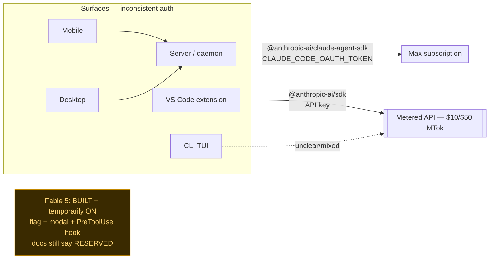
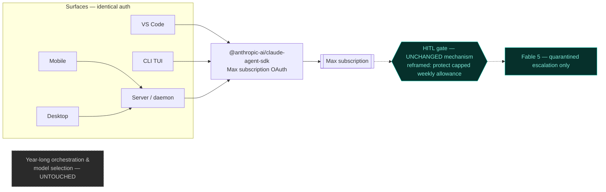

# Fable 5 — Current vs. Desired (Auth Unification + Gate Reframe)

**Date:** 2026-07-20
**Status:** Comparison captured — feeds `.prism/shared/plans/2026-07-20-fable-subscription-unification.md`
**Owner:** Gavin
**Trigger:** Fable 5 became a permanent, *included* feature of the Max / Team Premium subscription (effective 2026-07-20), capped at 50% of the standard weekly usage limit. The metered-API cost premise the Prism gate was built on is now false for subscription surfaces.

> **Firewall (read first):** This is an **auth + framing** change. It does **NOT** touch the role-based model selection / dispatch / orchestration design built over the past year, and it is **NOT** the fable-method Router refactor ([2026-07-18-fable-method-prism-integration.md](../brainstorms/2026-07-18-fable-method-prism-integration.md)). Fable stays quarantined behind the HITL gate — opt-in, never a default, never folded into `role_defaults`.

---

## The one-line resolution

"Turn off the flag" ≠ remove Fable. It = **retire the metered / temporary / 🔒 RESERVED framing** (now false under subscription) **while keeping the HITL gate mechanism intact.** The gate's *rationale* shifts from "~2.6× metered dollars, confirm the spend" → "you're spending a **capped weekly Max Fable allowance**, confirm before you burn it."

---

## As-built today (the real state)

Fully built (T1–T4), *temporarily* switched on via `.prism/local/fable.flag`, but the reference docs still disavow it as RESERVED. That contradiction is the core defect.

**Problems:** (a) VS Code is the lone metered holdout — it can never draw on your Max-included Fable; (b) `refusal` handling lives only on the metered path; (c) docs contradict the code.

---

## Desired

---

## Dimension-by-dimension

| Dimension | Current (as-built) | Desired |
|---|---|---|
| **Auth** | VS Code = metered API key ([claude-sdk.ts:44](../../../apps/prism-vscode/src/core/api/claude-sdk.ts)); server/mobile = Agent SDK + subscription OAuth. Inconsistent. | All surfaces (CLI TUI, VS Code, desktop, mobile) identical: Agent SDK + Max subscription OAuth |
| **Fable enablement** | Built + *temporarily* on via flag; docs say 🔒 RESERVED | Standing subscription feature; docs trued-up |
| **Framing / rationale** | "~2.6× Opus **metered $/call**" | "**capped weekly Max allowance** + HITL control" |
| **HITL gate** | App modal + PreToolUse hook (flag ON→ask, OFF→deny/Opus) | **KEEP mechanism verbatim**; reword copy only |
| **`refusal` handling** | Only on metered extension path | Uniform in shared Agent-SDK path |
| **Docs / mirrors** | Docs contradict code; setup mirrors + frozen eval snapshots duplicate the gate | True-up live docs + setup mirrors; **leave eval snapshots frozen** |
| **Orchestration / model selection** | Stable, year-long design | **UNCHANGED — hard non-goal** |

---

## Non-goals (the firewall, restated)

- ❌ Do not change any default-model / role / dispatch behavior.
- ❌ Do not make Fable a default anywhere, or add it to `role_defaults`.
- ❌ Do not undertake the fable-method Router refactor here (separate track).
- ❌ Do not edit frozen eval snapshots under `.prism/shared/evals/*-snapshot/`.
